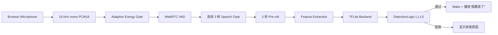
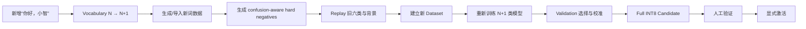

# WakeWord-Studio

> 面向自定义中文离线唤醒词的数据构建、模型训练、评估、实时测试与嵌入式部署准备平台

WakeWord-Studio 把唤醒词项目中原本分散的数据生成、WAV 导入、增强、训练、量化、离线评估、实时麦克风测试和模型管理连接成一条可追溯工作流。用户既可以训练一个“唤醒 / 非唤醒”的 Binary KWS，也可以训练一个同时区分背景与多个提示词的 Multi-KWS 模型，并在浏览器里查看 Top1、Top2、Margin、VAD 状态和拒绝原因。

当前项目已完成六提示词 Teacher-Six 的 BC-ResNet 与 ConvMixer 正式训练、Validation 冻结、Full INT8 导出和一次冻结 Test 评估。默认活动模型是 `teacher_six_convmixer`。真人麦克风正式验收、长时间 False Wake 测试、新增第七提示词的完整正式 run 与 ESP32-S3 实板运行仍未完成；当前结果没有达到 98% 目标。

## 目录

- [项目定位](#项目定位)
- [核心功能与真实状态](#核心功能与真实状态)
- [系统工作流](#系统工作流)
- [当前支持的模型](#当前支持的模型)
- [Teacher-Six 六提示词](#teacher-six-六提示词)
- [Class 0 background 怎么理解](#class-0-background-怎么理解)
- [当前正式效果](#当前正式效果)
- [环境要求](#环境要求)
- [安装](#安装)
- [启动](#启动)
- [三分钟快速体验](#三分钟快速体验)
- [Web UI 使用说明](#web-ui-使用说明)
- [新增提示词为什么需要重新训练](#新增提示词为什么需要重新训练)
- [实时 DetectionLogic](#实时-detectionlogic)
- [当前状态](#当前状态)
- [项目目录](#项目目录)
- [开源与发布边界](#开源与发布边界)
- [注意事项](#注意事项)
- [进一步阅读](#进一步阅读)

## 项目定位

一个完整的自定义唤醒词系统不只是一个 `.tflite` 文件。它还需要明确哪些声音是正样本、哪些近音短语是 hard negative，避免 Train / Validation / Test 泄漏，冻结模型选择与阈值，正确处理实时音频，并在部署前记录模型来源、版本和限制。

WakeWord-Studio 因此围绕以下闭环设计：

1. 输入中文提示词，或导入已有 WAV；
2. 生成多说话人、多语音 source 数据并执行增强；
3. 构建互不混用的 Train / Validation / Test；
4. 训练 Binary KWS 或 Multi-KWS；
5. 只用 Validation 做 checkpoint 选择和 operating-point 校准；
6. 导出 Full INT8 TFLite；
7. 用冻结设置做离线评估和浏览器实时测试；
8. 通过 Model Registry 显式激活、回滚或导出部署包。

当前仓库既保存了历史 Binary 路线，也保存了正式 Teacher-Six Multi-KWS 路线。两者任务定义不同，不应直接混成同一张性能表：Binary 只回答“是不是目标词”，Multi-KWS 还回答“最像哪一个提示词”。

## 核心功能与真实状态

状态含义：✅ 已实现并有对应正式产物或自动化验证；🟡 已实现但仍需人工、长时间或硬件验证；⚠️ 仅部分完成、只做过 smoke / preflight，或尚未跑正式任务。

| 功能 | 状态 | 当前事实 |
|---|---|---|
| 自定义中文提示词 | ✅ | 支持词表与拼音规范化，可建立 Binary 或 N-class Multi-KWS 配置 |
| 自动语音数据生成 | ✅ | 已用 Kokoro 与 VoxCPM1.5 生成正式 Teacher-Six 数据 |
| 用户 WAV 导入 | ✅ | 可导入本地语音文件并保留来源元数据；不会凭声音推断年龄 |
| 数据增强 | ✅ | 支持速度、增益、首尾静音、混响、远场、SNR 与多类噪声 |
| 数据隔离 | ✅ | manifest 记录 split、speaker/reference、`base_sample_id` 与 hash |
| Binary KWS | ✅ | 已有 microWakeWord、RepCNN、BC-ResNet、ConvMixer 历史正式产物 |
| Multi-KWS | ✅ | 已完成 background + 六提示词的 Teacher-Six 正式实验 |
| 多模型训练 | ✅ | BC-ResNet 与 ConvMixer 共用公平协议；正式 Multi-KWS 训练要求 GPU fail-fast |
| Full INT8 TFLite | ✅ | Teacher-Six 两模型及历史 Binary 模型均有冻结量化产物 |
| FP32 ONNX 板端交付 | ✅ | Teacher-Six BC-ResNet 与 ConvMixer 已从 best Float checkpoint 导出并通过 ONNX checker、ONNX Runtime 和 Validation 等价性验证 |
| Validation / Test | ✅ | Teacher-Six 已完成 Validation 收口及一次冻结 Test；Test 未参与此前选择 |
| Confusion matrix | ✅ | 报告保留逐类 Recall、混淆对、source 分解与背景误接受 |
| Top1 / Top2 / Margin | ✅ | Multi-KWS 后端与实时 UI 可显示第一候选、第二候选及分差 |
| DetectionLogic | ✅ | 已实现连续证据、背景比、冷却、多词仲裁和前后静音状态机 |
| 浏览器麦克风 | ✅ | 浏览器采集后转换为 16 kHz / mono / PCM16，送入 HTTP 实时链路 |
| 真人麦克风正式验收 | 🟡 | UI、会话记录与反馈 schema 已实现；`REAL_MIC_ACCEPTANCE=PENDING` |
| False Wake 统计 | 🟡 | 统计界面与会话能力已实现；长时间真实环境测试尚未完成 |
| 新增提示词再训练 | ⚠️ | preflight、job、replay、candidate、激活链路已实现；未跑新增词正式闭环 |
| Model Registry | ✅ | 统一 Binary、Multi-KWS、历史模型与 imported model 的发现和状态展示 |
| 显式激活 / 回滚 | ✅ | 活动模型写入独立状态；候选训练失败不会替换当前 active model |
| Imported TFLite | ✅ | 可登记并做推理兼容性检查；不等同于可继续训练 |
| ESP32-S3 部署准备 | 🟡 | 有 INT8 产物、模型检查与 ESP-IDF 工程骨架；尚无实板结果 |

## 系统工作流

### 模型开发流程


正式实验中，训练只读取 Train，checkpoint、阈值和 margin 只由 Validation 决定；Test 在模型与 operating point 冻结后才读取。Teacher-Six 的原 Test 已经执行过一次，后续如果依据其结果继续改模型，它就只能作为“已知评估集”，不能继续称为 untouched holdout。

### 实时识别流程



### Multi-KWS 决策

```text
7-class softmax
      │
      ├─ Top1 = background ───────────────→ 拒绝
      │
      └─ Top1 = 某个提示词
             ├─ Top1 score 不足 ─────────→ 拒绝
             ├─ Top1 - Top2 margin 不足 ─→ 多词竞争，拒绝
             └─ 冻结条件 + L1–L5 通过 ──→ 唤醒并报告词名
```

## 当前支持的模型

| 模型 | 类型 | 任务 | Full INT8 大小 | 当前角色 | 状态 |
|---|---|---|---:|---|---|
| microWakeWord / MixedNet Tiny | 流式轻量网络 | Binary | 52,840 B（51.60 KiB） | Tiny 历史基线 | `HISTORICAL`，未实板验证 |
| RepCNN | 滚动窗口卷积网络 | Binary | 112,816 B（110.17 KiB） | 性能型历史基线 | `HISTORICAL`，未实板验证 |
| BC-ResNet Binary | Broadcasted Residual Network | Binary | 108,784 B（106.23 KiB） | 公平对照历史模型 | `HISTORICAL` |
| ConvMixer Binary | 声学 ConvMixer | Binary | 59,984 B（58.58 KiB） | 公平对照历史模型 | `HISTORICAL` |
| BC-ResNet Teacher-Six | 7-class softmax | Multi-KWS | 108,080 B（105.55 KiB） | `COMPUTE_LIGHT_BASELINE` | 正式训练、INT8、Test 已完成 |
| ConvMixer Teacher-Six | 7-class softmax | Multi-KWS | 60,408 B（58.99 KiB） | `PRIMARY_CANDIDATE` | 正式训练、INT8、Test 已完成，当前 active |
| Imported TFLite | 取决于模型 | Binary 或经声明的兼容任务 | 取决于文件 | `IMPORTED` | 可做兼容性检查；未必可训练 |

Binary 模型输出 wake / non-wake 分数；Teacher-Six 输出 `background + 6 个提示词` 的类别分布。模型文件更小不代表 MACs 更低，也不代表在目标 MCU 上延迟更低。

## Teacher-Six 六提示词

| Class | keyword_id | 显示文本 |
|---:|---|---|
| 0 | `background` | 背景 / 拒识 |
| 1 | `qingxiaojia` | 你好，青小甲 |
| 2 | `doudou` | 你好，豆豆 |
| 3 | `diandian` | 你好，点点 |
| 4 | `xiaorui` | 你好，小瑞 |
| 5 | `duoduo` | 你好，多多 |
| 6 | `jizhiwa` | 你好，吉智娃 |

当前默认正式模型：`teacher_six_convmixer`。

- BC-ResNet：`COMPUTE_LIGHT_BASELINE`，静态估算 MACs 更低；
- ConvMixer：`PRIMARY_CANDIDATE`，当前综合 Test 表现更均衡，TFLite 文件更小，但计算量更高。

## Class 0 background 怎么理解

Teacher-Six 是一个 7-class 模型，不是六个互不相关的二分类模型。`class 0 = background` 是**拒识类**，表示当前输入不像六个目标唤醒词中的任何一个。训练中的 background 覆盖普通语音、专门设计的近音 hard negatives、环境噪声和静音等样本。

- 环境音、普通聊天或不完整短语通常应落入 `background`，从而不触发唤醒；
- `background` 不会进一步区分“风扇”“键盘”“汽车”等声音类型，本项目不是环境声分类器；
- 7-class softmax 每次都会输出一组分数，板端不能只看最大类别就触发，仍必须执行模型 metadata 中冻结的 threshold / margin 和实时 DetectionLogic；
- `background` 在离线数据上的表现不等于真实环境每小时误唤醒率，后者仍需长时间连续麦克风测试。

## 当前正式效果

下表只使用已存在的 Teacher-Six Full INT8 冻结 Test 报告，不重新读取或重跑 Test。每个模型使用在 Validation 上冻结的 threshold / margin。

| 指标 | BC-ResNet INT8 Test | ConvMixer INT8 Test |
|---|---:|---:|
| Macro Recall | 89.89% | **94.22%** |
| Macro Precision | 86.59% | **87.41%** |
| Macro F1 | 87.94% | **90.47%** |
| Micro Accuracy | 88.13% | **89.73%** |
| Worst Keyword Recall | 74.00% | **88.00%** |
| Background FAR | **14.50%** | 17.00% |
| TFLite size | 105.55 KiB | **58.99 KiB** |
| Estimated MACs | **6,589,720** | 24,192,336 |

ConvMixer 的六词整体识别和最弱词更均衡，量化稳定性也优于 BC-ResNet，但其静态计算量约为 BC-ResNet 的 3.67 倍，Test Background FAR 也更高。BC-ResNet 更适合作为低计算量基线，但其 INT8 Validation 相对 Float 明显退化，且 Test 上“青小甲”的 Recall 只有 74%。这是一组工程取舍，不是“文件最小就绝对最好”。

**98PCT = NOT_ACHIEVED。** 当前不能宣称达到 98% 总体 Recall、98% 最弱词 Recall或可部署验收标准。

## 环境要求

### 日常运行

- Windows 10/11；
- 核心包支持 Python `>=3.10`；运行现有 TFLite Web 后端的 `runtime` extra 需要 Python `>=3.11`；
- 支持麦克风权限、Web Audio 与 `getUserMedia` 的现代浏览器；
- 实时体验需要可用麦克风与音频输出；
- 项目音频规范为 16 kHz、mono、PCM16。

### 训练与重型依赖

- 当前开发机正式训练路径使用 WSL + TensorFlow 2.21 + NVIDIA RTX 4060 Laptop GPU；
- 正式 Multi-KWS 模式有 GPU fail-fast，不允许悄悄退回 CPU；
- 普通代码测试、文档浏览、部分数据工具或 UI 启动并不都强制要求 GPU；
- Kokoro、VoxCPM、TensorFlow GPU、CUDA/WSL 属于较重且环境敏感的栈，不应为了“升级到最新”而盲目改变已工作的 TensorFlow、NumPy 或 Torch 组合。

根 `pyproject.toml` 声明了项目核心依赖，以及 `runtime`、`demo`、`test` extras；其中 `runtime` 固定当前验证过的 TensorFlow 2.21，并把 LiveKit wake-word 前端固定到具体上游 commit。Kokoro、VoxCPM、CUDA/WSL 等数据生成与正式训练栈没有被打包成跨平台环境；复现训练时仍应以对应 run、config、脚本和环境记录为准。

## 安装

### A. 新环境：安装核心项目、Web 导入能力与测试依赖

远程仓库建立后，在 PowerShell 中执行（把 `<REPOSITORY_URL>` 替换为实际 GitHub clone URL）：

```powershell
git clone <REPOSITORY_URL>
cd WakeWord-Studio
py -3.11 -m venv .venv
.\.venv\Scripts\Activate.ps1
python -m pip install --upgrade pip
python -m pip install -e ".[runtime,demo,test]"
```

如果源码已经下载，则从 `cd WakeWord-Studio` 开始即可。下面出现的 `F:\ZJU_intership\task\4\WakeWord-Studio` 只表示原开发机参考路径，不是项目运行所必需的路径。

这会按正式依赖声明安装项目核心依赖，包括 `numpy`、`pypinyin`、`PyYAML`、`scipy`、`soundfile`、`webrtcvad`；同时安装经当前 Web/TFLite runtime 验证的 TensorFlow、LiveKit wake-word 前端，以及 `sounddevice`、`pytest`。该命令用于启动和体验已发布模型，不包含 Kokoro、VoxCPM、CUDA/WSL 等数据生成与正式训练依赖。

### B. 当前开发机的已配置环境

当前仓库内开发环境位于 `.envs/livekit`，可直接用它启动：

```powershell
cd F:\ZJU_intership\task\4\WakeWord-Studio
.\.envs\livekit\Scripts\python.exe .\run_studio.py
```

`.envs/livekit` 是当前开发机环境，不应视为其他机器唯一或可移植的安装方式。

## 启动

### 标准已安装环境

```powershell
cd WakeWord-Studio
python .\run_studio.py
```

### 当前开发环境

```powershell
cd F:\ZJU_intership\task\4\WakeWord-Studio
.\.envs\livekit\Scripts\python.exe .\run_studio.py
```

打开：<http://127.0.0.1:8765>

默认入口是 Browser Dashboard。`run_studio_modern.py`、`run_studio_desktop.py` 与 `run_studio_legacy.py` 为保留的历史/替代入口；新用户优先使用 `run_studio.py`。

## 三分钟快速体验

1. 用上面的命令启动服务，确认终端没有端口占用错误；
2. 打开 `http://127.0.0.1:8765`；
3. 进入“实时唤醒”页面并允许浏览器访问麦克风；
4. 在模型选择器中确认 `Teacher-Six ConvMixer` 为活动模型；
5. 点击开始监听，依次尝试六个正式提示词；
6. 观察 Top1、Top2、Margin、VAD、Detection 与 rejection reason；
7. 发生最终唤醒事件时，系统会排队播放“我醒来了”。

这只是交互体验，不等于正式真人验收。正式验收还需要固定说话人、距离、噪声、重复次数和 False Wake 时长并保存记录。

## Web UI 使用说明

### 1. 数据集生成

用于创建项目、选择提示词与语音 provider、配置样本量和增强，或导入用户 WAV。生成器会把 label、split、speaker/reference、source、增强参数和文件 hash 写入 manifest，并支持任务状态与 resume。

正式任务前先看 preflight 和预计耗时。不要把程序噪声 `procedural_ambient` 当作第二个 speech source，也不要在缺少年龄 metadata 时把 multi-speaker 写成 multi-age。

### 2. 模型训练

- Binary：适合单一目标词，输出 wake / non-wake；
- Multi-KWS：适合一个模型同时区分多个提示词，输出 background + N 个类别。

训练页负责生成可审计的 job/config/command 和展示状态。正式 Teacher-Six 已使用 BC-ResNet 与 ConvMixer 的一致实验协议。新任务应使用新的 run directory，不能覆盖冻结历史 run；Test 不应用于 checkpoint、threshold 或 margin 选择。

### 3. 实时唤醒

1. 授权浏览器麦克风；
2. 选择 Registry 中可运行的模型；
3. 开始监听；
4. 查看能量门、VAD、连续语音帧、Top1、Top2、Margin、background score 和最终 Detection；
5. 如果未唤醒，结合 rejection reason 判断是背景类、分数不足、Margin 过小、连续证据不足、冷却中还是等待尾静音。

浏览器向 `/api/live/audio` 发送音频片段，页面轮询状态；当前链路不是 WebSocket。页面可记录真人验收反馈与 False Wake 会话，但正式长时结果仍是 Pending。

### 4. 模型与部署

Model Registry 统一展示：

- `ACTIVE`：当前实时使用的模型；
- `BASELINE`：保留用于计算量/效果对照的模型；
- `HISTORICAL`：历史冻结模型；
- `CANDIDATE`：训练完成但尚未由用户激活的新模型；
- `IMPORTED`：从外部登记的 TFLite。

“激活”是显式操作；新 candidate 不会自动覆盖 active model。回滚会恢复先前模型。部署页可以查看模型元数据、兼容性与导出准备状态，但 ESP32-S3 仍需要真实工具链和开发板验证。

## 新增提示词为什么需要重新训练

以在 Teacher-Six 中新增“你好，小智”为例，Softmax 输出头原本只有 `background + 6` 类。仅在 UI 中加一个名字不会让现有权重凭空获得第七个提示词的类别边界，因此：

**ADD_KEYWORD_REQUIRES_RETRAIN=true**

完整流程是：



Replay 旧类用于降低 catastrophic forgetting：如果只给模型看新词，它可能学会“你好，小智”却破坏原六词边界。新增任务失败、取消或只完成一部分时，旧 active model 保持不变。当前代码已具备计划、job、candidate 与激活骨架，但尚未完成一个新增第七词的正式全流程 run。

## 实时 DetectionLogic

模型的一次高分不能直接等价成可靠唤醒。瞬时噪声、相似词、尾音、多个类别竞争以及重复窗口都可能制造单帧高分，因此运行时还使用五层判定：

| 层 | 机制 | 解决的问题 |
|---|---|---|
| L1 | 连续若干帧达到分数要求 | 过滤单帧尖峰和瞬时噪声 |
| L2 | 当前峰值相对该词背景指数滑动均值足够高 | 防止持续高背景把绝对分数整体抬高 |
| L3 | 唤醒后的 cooldown | 避免同一次发音被连续窗口重复唤醒 |
| L4 | Binary 多分数仲裁，或 Multi-KWS 的 background / Top1 / margin 冻结判定 | 处理相似词竞争和不确定输出 |
| L5 | 要求合理的前静音与后静音状态转换 | 避免在连续话语中间或未结束时过早触发 |

在 L1–L5 前，Energy Gate、WebRTC VAD 和连续 3 帧 Speech Gate 先避免无语音时频繁运行 KWS；2 秒 pre-roll 保存起音，防止 VAD 变为 speech 时丢掉词首。通过全部条件后才产生 final wake event，并由 FIFO 播放队列播放“我醒来了”。

## 当前状态

| 状态变量 | 当前值 |
|---|---|
| Teacher-Six Multi-KWS 正式训练 | `COMPLETED`（BC-ResNet、ConvMixer） |
| Teacher-Six Validation 收口 | `COMPLETED` |
| Teacher-Six 冻结 Test | `COMPLETED_ONCE` |
| Teacher-Six Full INT8 | `COMPLETED` |
| Teacher-Six FP32 ONNX | `COMPLETED`，checker / ONNX Runtime / Validation equivalence 均通过 |
| 默认活动模型 | `teacher_six_convmixer` |
| Web Dashboard | `IMPLEMENTED`，服务/API smoke 已完成 |
| Model Registry / activation / rollback | `IMPLEMENTED` |
| REAL_MIC_ACCEPTANCE | `PENDING` |
| FALSE_WAKE_LONG_RUN | `PENDING` |
| ADD_KEYWORD_FORMAL_RUN | `PENDING` |
| ESP32S3_RUNTIME_VERIFIED | `false` |
| 98PCT | `NOT_ACHIEVED` |

## 项目目录

```text
WakeWord-Studio/
├─ src/wakeword_studio/   核心数据、训练、后端、运行时、Registry 与 Web API
├─ phase0/ ... phase11/   各阶段脚本、preflight、smoke、导出与历史证据
├─ configs/               模型、数据、Multi-KWS 与 demo 配置
├─ artifacts/             可公开的小型 INT8 模型、metadata 与精简数据说明
├─ deliverables/          Teacher-Six FP32 ONNX 板端交付包与验证向量
├─ runtime/               默认活动模型状态；本地反馈和会话文件被 Git 忽略
├─ reports/               正式结果、阶段总结与运行索引
├─ firmware/              ESP32-S3 工程骨架与部署准备
├─ tests/                 单元、集成与回归测试
├─ run_studio.py          推荐 Browser Dashboard 入口
└─ pyproject.toml         Python 项目与依赖声明
```

`phase*` 目录包含过程性证据；面向当前结果请优先阅读 `reports/`。完整 `runs/`、`datasets/`、checkpoint、WAV 和 feature cache 只保存在原开发机并被 Git 忽略，公开仓库通过 config、精简 metadata、hash、报告和发布模型保留可审计 lineage。

## 开源与发布边界

### GitHub 中包含

- 项目源码、配置、测试、训练/评估/导出脚本、Web UI 与 ESP32-S3 工程骨架；
- 可直接运行演示的小型冻结 INT8 TFLite；
- Teacher-Six FP32 ONNX 板端交付包、固定 Validation test vectors 与 SHA256；
- 精简数据集 metadata、实验报告和 run lineage。

### GitHub 中不包含

- 原始或增强 WAV、完整逐样本 manifest、个人录音；
- Train / Validation / Test feature NPY/NPZ；
- `runs/`、checkpoint、Keras weights、TensorBoard 日志；
- `.envs/`、CUDA/TTS/模型下载缓存、`g2pW/` 本地缓存；
- API key、token、`.env`、私钥、本地反馈和麦克风会话记录。

因此，公开 clone 支持阅读、安装、Web UI、发布模型推理、测试和板端转换；它**不承诺无需外部数据和重型环境即可逐字节重跑全部正式训练**。数据生成和正式 GPU 训练需要用户自行取得并遵守相关模型、数据与语音 reference 的许可，重建本地环境和数据集。

### 模型与能力边界

- 当前性能来自合成/增强数据和一次冻结离线 Test，不代表所有真人、口音、麦克风和噪声环境；
- `REAL_MIC_ACCEPTANCE=PENDING`、`FALSE_WAKE_LONG_RUN=PENDING`；
- ONNX Runtime 通过不等于芯片实板通过，`CHIP_RUNTIME_VERIFIED=false`；
- 本项目不是安全关键系统、说话人认证系统或环境声音分类器；不能将一次唤醒结果用于身份验证、门锁或付款授权；
- 发布模型不包含训练 WAV，也不得用本仓库推断或还原 reference speaker 的个人信息。

### 许可证

本项目采用 [Apache License 2.0](LICENSE)。除文件中另有声明外，仓库内原创源码、文档以及由本项目训练并明确放入发布目录的模型 artifact 按 Apache-2.0 提供；第三方组件仍遵循各自许可证。

Apache-2.0 不会替使用者取得数据、语音 reference、商标、人格权或其他第三方权利。重新训练、重新分发模型或用于商业产品前，仍应核对实际使用的上游版本和当地法律。第三方来源、未随仓库分发的内容及复核事项见 [THIRD_PARTY_NOTICES.md](THIRD_PARTY_NOTICES.md)。

## 注意事项

- 浏览器第一次使用麦克风时必须授权；拒绝权限会导致实时链路没有音频。
- 不要同时启动多个监听 `8765` 的旧服务。多进程会造成页面、API、Registry 与实际 runtime 版本不一致。
- 如果页面看起来不是当前版本，先确认端口进程，再强制刷新；服务已对关键静态资源设置避免旧缓存的策略。
- Teacher-Six Test 已经使用过。未来基于其结果调模型后，必须建立新的 untouched holdout 才能做无偏最终评估。
- Background FAR 是离线背景样本被接受的比例，不等于每小时误唤醒次数；`False Wakes/hour` 必须靠连续真实环境时长测量。
- Imported TFLite “可以推理”不代表“可以继续训练”。继续训练通常需要可训练图、权重、类别语义、前端和原数据契约。
- 不要混用 Binary threshold 与 Multi-KWS 的 Top1 / margin operating point。
- 不要把多 Kokoro speaker 写成多 speech source；Teacher-Six 的两个 speech source 是 Kokoro 和 VoxCPM1.5。
- 数据集没有可靠年龄标签，`AGE_VERIFIED=false`。
- ESP32-S3 当前只有部署准备和工程骨架，`ESP32S3_RUNTIME_VERIFIED=false`。
- 模型文件大小与 MACs 是不同维度：ConvMixer 文件更小，但静态估算计算量更高。

## 进一步阅读

- [GitHub 发布模型与 artifact 清单](artifacts/README.md)
- [第三方组件、数据来源与许可证边界](THIRD_PARTY_NOTICES.md)
- [GitHub 发布前审计](reports/GITHUB_RELEASE_AUDIT.md)
- [Teacher-Six ONNX 板端交付](deliverables/onnx_board_test/README.md)
- [数据集复现与发布策略](docs/DATASETS.md)
- [关键正式 run 索引](reports/RUN_INDEX.md)
- [Teacher-Six Multi-KWS 正式 Validation/Test 报告](reports/multikws/README.md)
- [Phase 10 产品化与当前限制](reports/phase10/README.md)
- [Phase 10 既有能力清单](reports/phase10/EXISTING_FEATURE_INVENTORY.md)
- [Phase 10 兼容性矩阵](reports/phase10/BEFORE_AFTER_COMPATIBILITY.md)
- [项目阶段性完整技术总结](reports/PROJECT_INTERIM_REPORT.md)
- [Model A 完整收口报告](docs/model_a/WakeWord_Studio_Model_A_Closure_Report.md)
- [Model B 阶段收口报告](docs/model_b/WakeWord_Studio_Model_B_Interim_Closure_Report.md)
