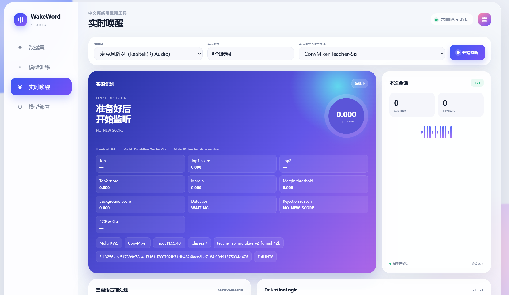
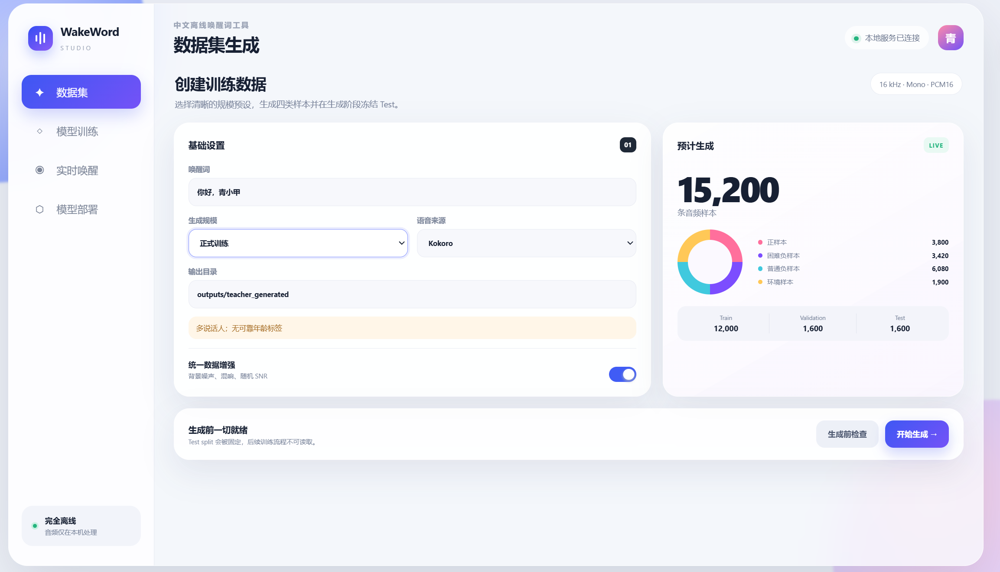
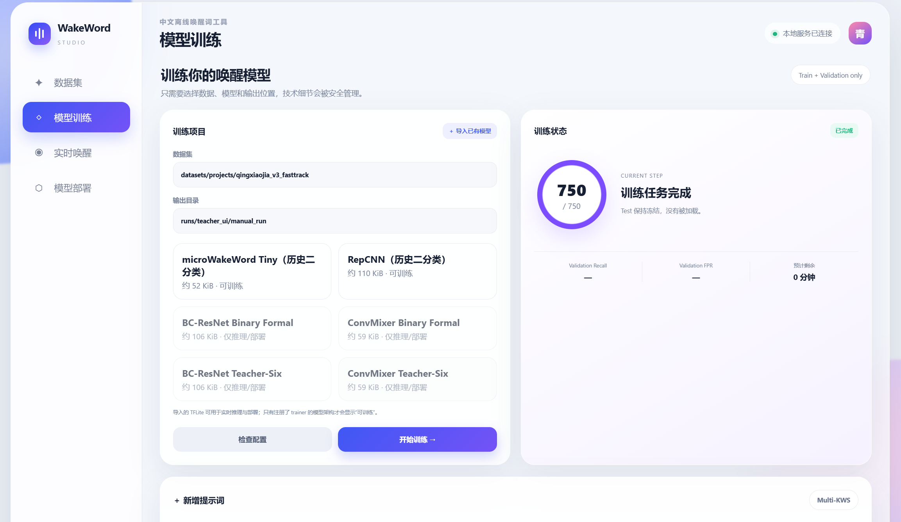
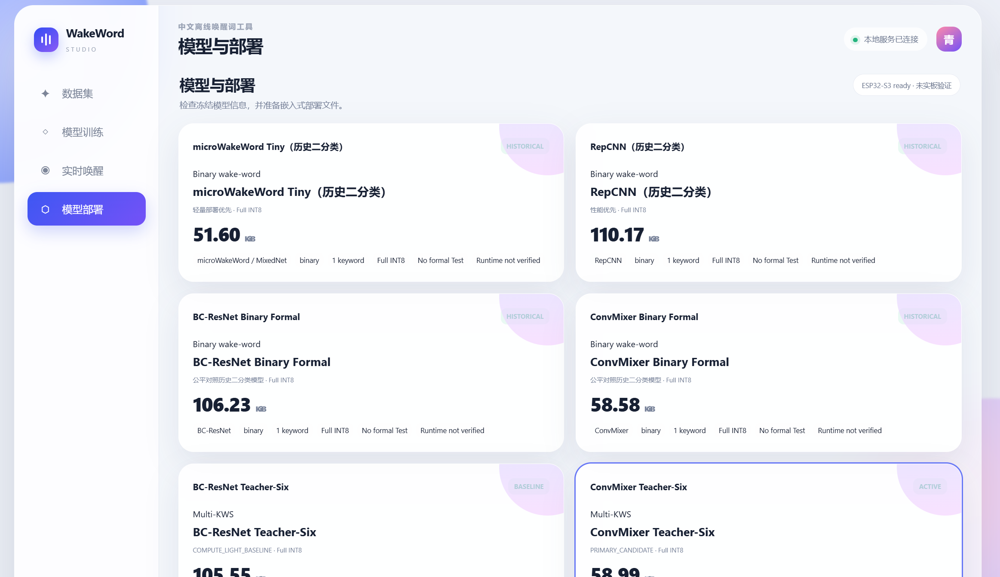

# WakeWord-Studio

WakeWord-Studio 是一个面向中文离线唤醒词的本地工具箱，覆盖数据准备、模型训练、离线评估、TFLite 推理、浏览器麦克风测试和 ONNX 导出。

仓库已经包含可运行的模型权重。完成依赖安装后，无需重新训练即可启动 Web UI，并使用默认的 Teacher-Six ConvMixer 模型体验六提示词识别。

## Web UI 预览

<table>
  <tr>
    <td width="50%" align="center"><strong>实时唤醒</strong><br></td>
    <td width="50%" align="center"><strong>数据集生成</strong><br></td>
  </tr>
  <tr>
    <td width="50%" align="center"><strong>模型训练</strong><br></td>
    <td width="50%" align="center"><strong>模型部署</strong><br></td>
  </tr>
</table>

界面覆盖数据准备、训练任务管理、浏览器麦克风测试和冻结模型部署。具体操作及当前能力边界见 [Web UI 使用指南](docs/USER_GUIDE.md)。

## 主要功能

- 使用一个模型区分背景和多个中文唤醒词；
- 在浏览器中进行实时麦克风测试，查看 Top1、Top2、分数差和拒绝原因；
- 管理、校验和切换已发布的 TFLite 模型；
- 导入本地 WAV，或为训练任务生成带来源记录的数据；
- 训练 BC-ResNet、ConvMixer 等模型并导出 Full INT8 TFLite；
- 导出 FP32 ONNX 模型和板端验证向量。

## 快速开始

推荐使用 Python 3.11，并安装到独立 Conda 环境。不要在 Anaconda `base` 中安装运行依赖。

如果还没有下载项目，请先在准备存放项目的**父目录**执行：

```powershell
git clone https://github.com/simonwang0207-lab/WakeWord-Studio.git
cd WakeWord-Studio
```

如果已经打开了 `WakeWord-Studio` 源码目录，请跳过上面的 `git clone` 和 `cd`，避免在仓库内部再次克隆一份同名项目。然后执行：

```powershell
conda create -n wakeword-studio-runtime python=3.11 -y
conda activate wakeword-studio-runtime
python -m pip install --upgrade pip
python -m pip install -e ".[runtime,demo]"
python .\run_studio.py
```

浏览器会自动打开 <http://127.0.0.1:8765>。如果没有自动打开，可以手动访问该地址。

数据生成、训练 run、实时识别和部署包的具体操作及保存位置，见 [Web UI 使用指南](docs/USER_GUIDE.md)。

第一次使用实时识别时，需要允许浏览器访问麦克风。默认活动模型为 `teacher_six_convmixer`，权重已经放在 `artifacts/models/teacher_six/`。

运行测试：

```powershell
python -m pip install -e ".[runtime,demo,test]"
python -m pytest -q
```

实时运行使用轻量 LiteRT，不需要安装完整 TensorFlow。基础安装也不会下载训练数据，或配置 Kokoro、VoxCPM、CUDA 和 WSL。

只有开发训练代码时才额外安装 TensorFlow：

```powershell
python -m pip install -e ".[runtime,demo,training]"
```

正式数据生成和 GPU 训练仍需要项目对应的独立环境与外部数据，不能只靠这一条命令完成。

## Teacher-Six 模型

Teacher-Six 是一个七分类模型：第 0 类负责拒绝非目标声音，其余六类对应六个唤醒词。

| 类别 | 内部名称 | 显示文本 |
|---:|---|---|
| 0 | `background` | 背景 / 非目标声音 |
| 1 | `qingxiaojia` | 你好，青小甲 |
| 2 | `doudou` | 你好，豆豆 |
| 3 | `diandian` | 你好，点点 |
| 4 | `xiaorui` | 你好，小瑞 |
| 5 | `duoduo` | 你好，多多 |
| 6 | `jizhiwa` | 你好，吉智娃 |

`background` 不是环境声音分类器。它表示输入不属于六个目标唤醒词，可能是普通谈话、相似但不完整的短语、环境噪声或静音。模型不会继续判断它是风扇声、汽车声还是键盘声。

仓库提供两个正式 Teacher-Six Full INT8 模型：

| 模型 ID | 架构 | 角色 | 文件大小 |
|---|---|---|---:|
| `teacher_six_convmixer` | ConvMixer | 默认模型 | 60,408 B |
| `teacher_six_bcresnet` | BC-ResNet | 低计算量对照模型 | 108,080 B |

仓库还保留了四个早期单唤醒词二分类模型。内部 ID `model_a` 和 `model_b` 仅为兼容旧配置而保留，分别对应 `microWakeWord Tiny` 和 `RepCNN`；它们不是当前 Teacher-Six 模型。

## 已发布权重

以下权重随 Git 仓库一起下载，不需要 Git LFS：

```text
artifacts/models/teacher_six/teacher_six_convmixer_full_int8.tflite
artifacts/models/teacher_six/teacher_six_bcresnet_full_int8.tflite
artifacts/models/binary/microwakeword_mixednet_full_int8.tflite
artifacts/models/binary/repcnn_full_int8.tflite
artifacts/models/binary/bcresnet_binary_full_int8.tflite
artifacts/models/binary/convmixer_binary_full_int8.tflite
```

`deliverables/onnx_board_test/models/` 还包含两个 Teacher-Six FP32 ONNX 模型。每个发布模型的输入输出、SHA256、阈值和来源记录见 [artifacts/README.md](artifacts/README.md)。

## 当前结果

以下是冻结配置下的一次离线 Test 结果，仅用于说明当前模型水平：

| 指标 | BC-ResNet INT8 | ConvMixer INT8 |
|---|---:|---:|
| Macro Recall | 89.89% | 94.22% |
| Worst Keyword Recall | 74.00% | 88.00% |
| Background FAR | 14.50% | 17.00% |
| 模型大小 | 105.55 KiB | 58.99 KiB |

这些结果来自合成和增强数据上的离线评估，不代表所有真人、口音、麦克风和噪声条件。项目尚未完成长时间真实环境误唤醒测试和 ESP32-S3 实板验收，不能把离线指标直接视为产品级性能。

详细评估方法和逐类结果见 [Teacher-Six 模型报告](reports/multikws/README.md)。

## 使用 Web UI

启动后可以使用以下页面：

- 数据集：创建数据任务或导入已有 WAV；
- 训练：生成训练配置并查看任务状态；
- 实时唤醒：使用浏览器麦克风测试已发布模型；
- 模型与部署：查看模型元数据、校验权重、激活模型或生成部署材料。

实时识别并不是简单地选择分数最高的类别。系统还会结合分数阈值、Top1 与 Top2 的差值、连续证据、静音状态和冷却时间，减少相似词和短时噪声造成的误触发。

如果要新增唤醒词，需要扩展类别和数据集后重新训练。只修改页面上的文字不会让现有模型获得识别新词的能力。

## 项目结构

```text
WakeWord-Studio/
├─ src/wakeword_studio/   核心 Python 代码
├─ configs/               数据、模型和演示配置
├─ artifacts/             随仓库发布的 TFLite 模型与元数据
├─ deliverables/          ONNX 模型和板端验证材料
├─ phase*/scripts/        数据、训练、评估和导出脚本
├─ phase7/webui/          浏览器界面
├─ firmware/              ESP32-S3 工程骨架
├─ tests/                 自动化测试
├─ docs/                  数据说明与历史技术记录
└─ reports/               模型评估及开发归档
```

`docs/`、`reports/` 和各 `phase*` 目录中保留了开发过程与实验记录，便于追溯，但不是第一次使用项目的必读内容。

## 数据与发布边界

公开仓库包含源码、配置、测试、已发布的小型模型权重和精简评估材料。以下内容不上传 GitHub：

- 原始或增强 WAV；
- 完整训练、Validation 和 Test 特征；
- checkpoint、Keras 权重和 TensorBoard 日志；
- 本地虚拟环境、TTS 模型缓存和 API 凭据；
- 麦克风会话及用户反馈记录。

因此，克隆仓库后可以直接安装并运行现有模型，但不能在没有外部数据和训练环境的情况下逐字节复现全部正式训练。数据来源、复现方式和许可注意事项见 [docs/DATASETS.md](docs/DATASETS.md) 与 [THIRD_PARTY_NOTICES.md](THIRD_PARTY_NOTICES.md)。

## 项目指导团队

本项目由浙江大学智能视觉实验室共同参与研发与指导。

- **赵磊老师** —— 浙江大学智能视觉实验室
- **邢卫老师** —— 浙江大学智能视觉实验室
- **林怀忠老师** —— 浙江大学智能视觉实验室

项目在浙江大学智能视觉实验室的研发环境与指导支持下持续推进。

## 许可证

项目原创代码和明确发布的项目模型采用 [Apache License 2.0](LICENSE)。第三方软件、数据集、TTS 模型和语音 reference 仍遵循各自许可证；重新训练、再分发模型或用于商业产品前，请核对 [THIRD_PARTY_NOTICES.md](THIRD_PARTY_NOTICES.md)。

## 相关文档

- [Web UI 使用指南](docs/USER_GUIDE.md)
- [模型文件与校验信息](artifacts/README.md)
- [数据集与复现说明](docs/DATASETS.md)
- [Teacher-Six 模型评估](reports/multikws/README.md)
- [ONNX 板端交付说明](deliverables/onnx_board_test/README.md)
- [第三方组件与许可证](THIRD_PARTY_NOTICES.md)
