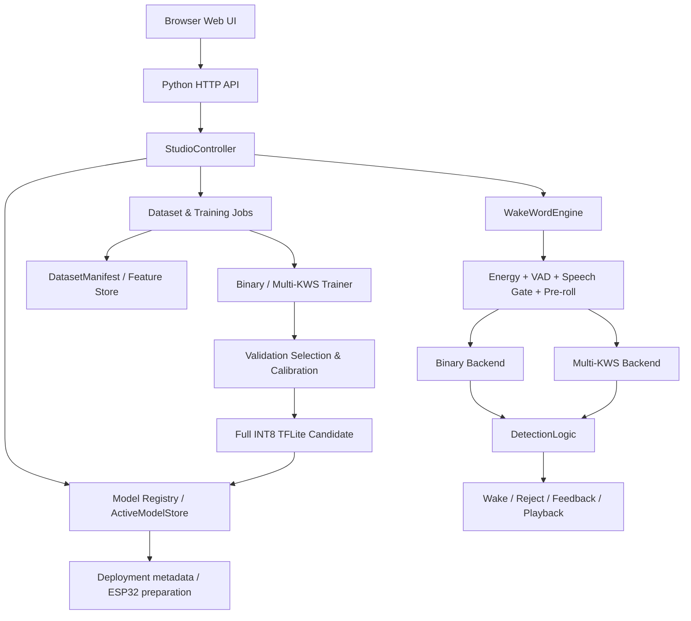

# WakeWord-Studio 阶段性技术总结报告

> 自定义离线唤醒词训练、评估、实时推理与嵌入式部署准备系统  
> **INTERIM REPORT｜截至 2026-09-01 当前代码与冻结 artifact 状态**

本文是项目从立项到 Phase 10 的阶段性技术复盘。它面向指导老师、答辩、后续接手者和未来维护，不是启动手册，也不把“已经写出代码”“通过 smoke”“跑完正式实验”“完成真人或实板验收”混为一谈。当前最重要的结论是：项目已经形成可运行、可训练、可量化、可比较、可实时观察和可管理模型的完整软件骨架，Teacher-Six 两个正式 Multi-KWS 模型已经完成冻结评估；但 98% 指标、真人正式验收、长时 False Wake、新增提示词正式闭环和 ESP32-S3 实板运行仍未完成。

## 目录

1. [报告口径与证据等级](#1-报告口径与证据等级)
2. [项目背景与原始任务](#2-项目背景与原始任务)
3. [总体技术路线演进](#3-总体技术路线演进)
4. [模型来源、实现与自训练权重](#4-模型来源实现与自训练权重)
5. [系统总体架构](#5-系统总体架构)
6. [数据体系与隔离原则](#6-数据体系与隔离原则)
7. [早期 Binary KWS 实验](#7-早期-binary-kws-实验)
8. [为什么从 Binary 扩展到 Multi-KWS](#8-为什么从-binary-扩展到-multi-kws)
9. [Teacher-Six 12K 正式数据集](#9-teacher-six-12k-正式数据集)
10. [BC-ResNet Multi-KWS 正式实验](#10-bc-resnet-multi-kws-正式实验)
11. [ConvMixer Multi-KWS 正式实验](#11-convmixer-multi-kws-正式实验)
12. [BC-ResNet 与 ConvMixer 对比](#12-bc-resnet-与-convmixer-对比)
13. [六提示词详细效果与错误模式](#13-六提示词详细效果与错误模式)
14. [指标解释](#14-指标解释)
15. [实时推理系统](#15-实时推理系统)
16. [DetectionLogic L1–L5](#16-detectionlogic-l1l5)
17. [Phase 10 Web 产品化](#17-phase-10-web-产品化)
18. [新增提示词机制](#18-新增提示词机制)
19. [模型管理、激活与回滚](#19-模型管理激活与回滚)
20. [Imported TFLite 的能力边界](#20-imported-tflite-的能力边界)
21. [ESP32-S3 部署准备](#21-esp32-s3-部署准备)
22. [主要工程问题、修复与经验](#22-主要工程问题修复与经验)
23. [当前软件功能总表](#23-当前软件功能总表)
24. [当前不足、风险与下一步计划](#24-当前不足风险与下一步计划)
25. [阶段性结论](#25-阶段性结论)
26. [附录：关键 artifact、hash、命令与状态](#26-附录关键-artifacthash命令与状态)

## 1. 报告口径与证据等级

本报告使用四种状态，避免把能力写得比实际更成熟：

- **正式完成并验证**：存在正式 run、冻结模型、评估报告或可追溯 hash；
- **已实现但待人工验证**：代码和 API 已存在，自动化/服务 smoke 可通过，但需要真人操作或长时间实验；
- **Smoke / preflight 完成**：只证明链路在小样本或受控条件下可运行，不代表正式效果；
- **Pending / 未实板**：尚无正式运行结果，不能用“支持”暗示已验收。

本文的 Teacher-Six 数字来自以下冻结 artifact，只做读取和汇总，没有重新执行 Formal Test：

- `datasets/projects/teacher_six_multikws_v2_formal_12k/DATASET_INFO.json`
- `datasets/projects/teacher_six_multikws_v2_formal_12k/DatasetManifest.json`
- `runs/multikws/teacher_six/bcresnet/formal/v2_12k_user_run_02/TRAINING_REPORT.json`
- `runs/multikws/teacher_six/convmixer/formal/v2_12k_user_run_01/TRAINING_REPORT.json`
- `reports/multikws/MODEL_SELECTION_VALIDATION.json`
- `reports/multikws/test/bcresnet/TEST_REPORT.json`
- `reports/multikws/test/convmixer/TEST_REPORT.json`

本文所称 Test 是“模型和 operating point 冻结后执行过的一次正式 Test”。它在当时未参与训练、checkpoint 选择或阈值校准；但现在结果已经被查看，因此如果后续根据这些错误修改模型，旧 Test 不能继续作为 untouched holdout。

## 2. 项目背景与原始任务

项目最初面向 ESP32-S3 离线唤醒场景，核心要求包括：

- 找到并实现两条可比较的开源模型架构路线；
- 目标模型体积大约处于 50–100 KiB 量级；
- 支持自定义中文唤醒词，而不是只能使用预训练固定英文词表；
- 自动生成或导入语音数据，包含正样本、普通负样本、近音 hard negative 与环境声；
- 训练并导出 Full INT8 TFLite；
- 在实时麦克风链路中识别后播放“我醒来了”；
- 为最终 ESP32-S3 部署做 operator、内存、输入输出与工程准备；
- 目标期望为 98% 识别效果。

早期工作以“你好，青小甲”的 Binary KWS 为主：每个模型只回答当前音频是不是目标词。随着老师提出“识别错了以后，它错成了哪一个词”这一问题，Binary 输出的解释能力不足。项目于是扩展到 Multi-KWS：一个模型同时输出 background 和多个提示词，从分类结构、混淆矩阵和实时 Top1/Top2 上直接观察词间竞争。

因此，项目当前定位已经从“训练一个小型中文唤醒模型”演进为“自定义离线唤醒词实验与产品化平台”：既保留历史 Binary 模型，也建立 Teacher-Six Multi-KWS、动态 Registry、Web 实时观察、新增提示词计划、候选激活与回滚。

## 3. 总体技术路线演进

项目目录中的 Phase 编号记录了真实演进，但部分阶段包含交叉任务，并非每个目录都只对应单一里程碑。按主要目标可概括如下。

### 3.1 Phase 0：模型调研、端侧约束与 POC

Phase 0 比较了不同唤醒词路线的输入、状态、TFLite 导出和 ESP32-S3 可行性。关键认识是：模型“能转 TFLite”不等于“适合 MCU”；必须同时检查模型大小、operator、输入窗口、是否维护流式 state、runtime 前后处理与量化输入输出。

这一阶段选择 microWakeWord / MixedNet 作为轻量 Model A，并保留更高容量卷积路线作为性能 Model B。POC 证明约 52 KiB 的 Full INT8 流式模型在文件层面可实现，但硬件运行仍需后续验证。

### 3.2 Phase 1：统一数据、后端与实时音频规范

项目统一了 16 kHz、mono、PCM16 音频规范，建立 DatasetManifest、provider、backend 抽象与实时引擎基本组件。此阶段把“原始音频文件”提升为有 label、split、speaker、source、声学增强和 hash 的可审计记录，为后续公平实验和 resume 打基础。

### 3.3 Phase 2：Model A microWakeWord 与数据域问题

Model A 经历 v1、v2 和 v3 sequence objective。早期结果暴露出训练分布、窗口截取、streaming 与非 streaming 口径、TTS source 泛化和 INT8 输出反量化问题。v2 数据引入更严格的 speaker-disjoint 与第二语音 source；v3 更贴近部署时序目标。

最终 Model A 形成 52,840 B Full INT8 流式产物，deployment parameter count 记录为 19,697。其价值是完成极小模型端到端闭环并暴露真实数据/运行时问题，不是达到高精度。冻结 v2 Test 上 Recall 为 59.00%、Precision 74.45%、F1 65.83%、FPR 6.75%，Kokoro 与 VoxCPM 的 Recall 差距仍很大。

### 3.4 Phase 3–6：Model B RepCNN 与运行时完善

RepCNN 路线先做 native implementation、tiny overfit、INT8 export smoke 和 benchmark，再进行正式训练、冻结、评估与后续性能实验。历史 frozen RepCNN B 在 v2 Test 上达到 Recall 75.75%、Precision 79.53%、F1 77.59%、FPR 6.50%；在公平二分类比较口径中，后续冻结版本记录 Recall 81.01%、Worst-source Recall 68.75%，但仍没有合理 98% operating point。

同期项目补齐了音频一致性审计、score smoothing、DetectionLogic、实时线程/后端集成和 ESP32 工程准备。最重要的经验是：提高容量能改善区分能力，但 hard negative、source gap 和真实连续流误唤醒不能只靠扩大模型解决。

### 3.5 Phase 7：Web UI、WAV 导入与产品入口

项目保留 desktop/legacy 入口，同时建设浏览器 Dashboard。数据生成、模型训练、实时唤醒、模型与部署逐步汇合到一个入口；本地 WAV 导入成为正式能力，用户不必只依赖 TTS。

### 3.6 Phase 8：BC-ResNet / ConvMixer Binary 公平对照

Phase 8 让 RepCNN、BC-ResNet 与 ConvMixer 尽量使用同一冻结 feature store、相同 split、相同 Validation-only selection 规则和 Full INT8 输出，避免“不同数据、不同指标、不同 Test 使用方式”造成伪公平。

二分类正式结果显示，BC-ResNet 的 Float 最佳 checkpoint 在 step 6500，但 Full INT8 在 FPR≤10% 下 Recall 从约 75.32% 降到 54.75%，Worst-source Recall 从 61.81% 降到 38.19%，显示明显 PTQ 敏感。ConvMixer 最佳 step 7000，INT8 在同口径下 Recall 约 86.71%、Worst-source Recall 76.39%，量化更稳定。这一结论推动后续 Multi-KWS 继续同时比较两个架构，而不是只保留文件较小或单一指标较高者。

### 3.7 Phase 9：Teacher-Six Multi-KWS

Phase 9 将六个提示词设为独立 class，并加入 background，构成 7-class softmax。正式数据从候选 4.8K 升级为 12K、多 source、speaker/reference-disjoint 数据集；训练协议固定后分别跑 BC-ResNet 与 ConvMixer。

工程上经历了 Windows 原子状态写入失败、数据生成 resume 与 Validation full-batch GPU OOM。修复后，base TTS 没有被重复生成；Validation 改为 batch=32 的顺序保持推理，最终两模型均完成正式训练、Validation 收口、Full INT8 与冻结 Test。

### 3.8 Phase 10：产品化整合

Phase 10 的目标不是重写已有系统，而是把历史 Binary、Teacher-Six、Imported 模型、实时后端、Registry、模型激活/回滚、真人验收、False Wake 和新增提示词工作流放进统一产品视图。

当前 Web/API/Registry/动态 Multi-KWS runtime 已实现并完成服务层 smoke；`pypinyin`、`PyYAML` 等 Phase 10 遗漏依赖已补入 `pyproject.toml`。但真人正式验收、长时 False Wake、新增第七词完整正式 run 与 ESP32 实板仍是 Pending。

## 4. 模型来源、实现与自训练权重

“架构来源”与“项目的训练产物”必须分开理解。

### 4.1 microWakeWord / MixedNet

架构思想来自面向微控制器的流式唤醒网络：以较小时间步输入和内部 state 逐步更新。项目实现了与本仓库前端、数据和 TFLite state 契约匹配的训练/导出链路。最终中文“你好，青小甲”权重是用项目自建数据训练得到，不是下载一个已经会识别该中文词的成品模型。

### 4.2 RepCNN

RepCNN 使用重复卷积块处理固定声学窗口，偏向性能而非最小状态。项目完成本地 Keras/TFLite 实现、训练、冻结和运行时 backend。当前 Registry 中 Model B 指向项目训练的 Full INT8 artifact，并非第三方中文成品权重。

### 4.3 BC-ResNet

BC-ResNet 使用 broadcasted residual 思路在时频图上建立局部与较长时域信息交互。项目中的 Binary 与 Multi-KWS 版本由本地模型构建器生成，最后分类头分别为 1 输出和 7 类输出。Teacher-Six 正式配置为 channels=40、depth=8、subbands=4、temporal dilations=[1,2,4]。

### 4.4 ConvMixer

ConvMixer 将声学时频图先做 patch embedding，再交替执行 depthwise mixing 与 pointwise channel mixing。Teacher-Six 配置为 hidden_dim=48、depth=6、kernel=[7,5]、patch=[3,2]、stride=[2,2]。其中文六词权重同样由项目 12K 数据训练。

用户可能产生“项目没有下载模型”的印象，是因为这里主要复用的是公开架构思想和本地实现，而不是下载固定中文唤醒词的预训练权重。真正被冻结的 `.tflite` 是项目在自建数据、既定 split 和训练协议下产生的 artifact。

## 5. 系统总体架构



### 5.1 Dataset 层

Dataset 层负责 provider、WAV 导入、音频标准化、增强、split、speaker/reference 隔离、记录 ID、hash、partial record 和 resume。正式数据不只由目录名表达，其完整契约在 manifest 中。

### 5.2 Trainer 层

Trainer 读取冻结的 Train/Validation 特征，使用 deterministic epoch shuffle；checkpoint ranking、threshold 和 margin 均由 Validation 决定。Multi-KWS 的 Validation、最终 Float、PTQ 前后 evaluator 都使用安全 mini-batch inference，避免一次把 1500 条送入 GPU。

### 5.3 Backend 层

统一 `WakeWordBackend` 隔离不同输入形状和状态契约。Binary backend 返回目标词分数；Multi-KWS backend 处理动态 N-class、class 0 background、Top1/Top2、margin 与冻结 operating point。

### 5.4 Runtime 层

Runtime 负责实时帧、Energy Gate、WebRTC VAD、speech gate、pre-roll、backend state reset、尾静音推理、DetectionLogic 和可观测日志。模型推理和最终 wake event 是两个层次。

### 5.5 Registry 与 Web 层

Registry 从配置和 artifact 建立模型清单，`runtime/active_model.json` 单独保存活动模型与回滚历史。Web UI 只通过当前 API 读取 Registry/runtime 状态，避免前端写死 Model A/B 而后端已经使用 Teacher-Six 的不一致。

### 5.6 Deployment 层

部署层记录 Full INT8、文件大小、SHA256、输入输出 shape/dtype、支持平台和硬件验证状态。ESP32 工程骨架存在不代表实板已跑通。

## 6. 数据体系与隔离原则

### 6.1 音频规范

所有正式音频统一为：

- sample rate：16,000 Hz；
- channel：mono；
- subtype：PCM16；
- 模型特征：99 × 40 的固定窗口（流式 Model A 使用自身 3 × 40 输入契约）。

统一格式防止模型把采样率、声道或编码差异误当成类别线索，也保证浏览器、离线 extractor 和 TFLite runtime 的输入可对应。

### 6.2 数据类别

- **Positive / wakeword class**：完整说出目标提示词；Multi-KWS 中六个词分别是独立正类。
- **Ordinary negative**：不包含正式唤醒词的普通语音，用来学习“有人说话但不应唤醒”。
- **Hard negative**：与目标词发音、字词或节奏相近的短语，用来压低最危险误唤醒。
- **Ambient**：office、fan/AC、keyboard、TV/speech、babble、street、car、classroom、cafe、device/mic 等环境或设备噪声。

在 Multi-KWS 中，其他五个正式 wake word 不是某一词的 background；它们是自己的独立 class。否则模型无法学习“豆豆、点点、多多”等相似类之间的边界。

### 6.3 语音 source 与 speaker

Teacher-Six 正式语音使用 Kokoro 和 VoxCPM1.5 + AISHELL-3 reference 两个 speech source。多个 Kokoro speaker 只是 multi-speaker，不自动等于 multi-source；procedural ambient 也不属于 speech source。

Kokoro 按 speaker ID 做 Train/Validation/Test 隔离；VoxCPM 按 AISHELL-3 reference speaker ID 隔离。manifest 记录：Kokoro train 8、validation 2、test 2 个 speaker；VoxCPM train 4、validation 2、test 1 个 reference speaker。两者 disjoint 均为 true。

项目没有可靠年龄标签，因此 `AGE_VERIFIED=false`。不能从声音主观判断年龄，也不能把 multi-speaker 写成 multi-age。

### 6.4 数据增强

正式 Train 增强启用：

- speed：0.90、0.97、1.04、1.10；
- gain：-4 至 +3 dB；
- leading silence：40–220 ms；
- trailing silence：40–250 ms；
- reverb probability：0.4；
- far-field probability：0.4；
- SNR：5、10、15、20 dB；
- noise：office、fan/AC、keyboard、TV/speech、babble、street、car、classroom、cafe、device/mic。

Validation/Test 使用更克制且同构的 evaluation augmentation：speed 0.97/1.00/1.04、gain -2 至 +2 dB、首尾静音 60–180 ms、reverb/far-field 概率 0.3、SNR 10/15/20 dB。固定 seed 和记录 effective parameters 使样本可追溯。

### 6.5 Split 与泄漏控制

Train 用于学习权重；Validation 用于 checkpoint、threshold、margin 和模型角色选择；Test 只用于冻结后的最终泛化评估。PTQ representative split 是 Train，转换 generator 逐样本/小批 yield，不把 9000 条一次塞入转换器。

`base_sample_id` 把同一 base TTS 的不同增强版本视为一组，避免其变体跨 split。Teacher-Six manifest 报告 `base_group_split_leakage=0`。这比仅检查文件名或“speaker 看起来不同”更严格。

## 7. 早期 Binary KWS 实验

Binary 实验与 Teacher-Six Multi-KWS 的类别定义、数据规模和评估口径不同。下表用于说明路线演进，不应把所有数字当作同一 Test 上的严格排名。

| 模型 | 架构/运行方式 | Full INT8 | 代表性冻结结果 | 主要结论 |
|---|---|---:|---|---|
| Model A microWakeWord | 原生流式、内部 state | 52,840 B | v2 Test Recall 59.00%，FPR 6.75% | 文件最小、流式闭环完成；容量与跨 source 泛化不足 |
| Model B RepCNN | 2 s 滚动窗口 | 112,816 B | v2 Test Recall 75.75%，FPR 6.50% | 区分能力提升；Vox 与 hard negative 仍弱 |
| BC-ResNet Binary | 广播残差声学网络 | 108,784 B | INT8 Validation FPR≤10% Recall 54.75%，Worst-source 38.19% | Float checkpoint 较好，但 PTQ 退化明显 |
| ConvMixer Binary | patch + depthwise/pointwise mixing | 59,984 B | INT8 Validation FPR≤10% Recall 86.71%，Worst-source 76.39% | INT8 较稳定，文件小，计算量未必最低 |

### 7.1 Model A 的教训

Model A 证明了 50 KiB 级流式 Full INT8 中文唤醒模型的工程可能性，也证明“模型小且能导出”与“真实可用”之间距离很大。早期非流式、streaming Float、streaming INT8 结果差异帮助排除“量化是唯一根因”；更大的问题来自数据 domain、窗口与 source 泛化。

其最终冻结 v2 Test 在 Kokoro 上 Recall 94.5%，VoxCPM 上约 23.5%，说明 overall 数字掩盖了严重 source gap。项目因此把多 source 与 worst-source Recall 纳入后续正式选择标准。

### 7.2 RepCNN 的教训

RepCNN 提升总体判别能力，但 frozen Validation 的 98% Recall operating point 会带来不可接受的 FPR。它表明“通过降低阈值达到 98% Recall”不是实际达标；必须同时报告 precision、FPR、hard-negative FPR 与最弱 source。

### 7.3 Binary BC-ResNet 的量化退化

BC-ResNet Float 最佳 checkpoint step=6500，在 FPR 约 9.83% 的工作点 Recall 75.32%、Worst-source Recall 61.81%、ROC-AUC 0.9272、PR-AUC 0.7571。最终 INT8 在 FPR=10% 时 Recall 54.75%、Worst-source 38.19%、ROC-AUC 0.8824、PR-AUC 0.6569。

约 -20.57 个 Recall 百分点、-23.61 个 Worst-source 百分点的变化不能忽略。最终 export 已经按最佳 Validation checkpoint 审计，但“从最佳权重导出”并不保证 PTQ 后保持 Float 性能。

### 7.4 Binary ConvMixer 的量化稳定性

ConvMixer Float 最佳 step=7000，在约 9.08% FPR 下 Recall 87.03%、Worst-source 75.69%。最终 INT8 在约 9.92% FPR 下 Recall 86.71%、Worst-source 76.39%，ROC-AUC 与 PR-AUC 只小幅变化。由于量化前后 operating point 经过各自 Validation 校准，不能说量化“提高了本质能力”，但可说在该冻结数据与指标下较稳定。

## 8. 为什么从 Binary 扩展到 Multi-KWS

假设六个 Binary 模型分别输出一个分数。当“你好，青小甲”被误报时，系统可能同时得到多个相互不可比的分数，而且每个模型阈值、校准和负样本定义不同。要回答“错成豆豆还是吉智娃”，还需要额外跨模型仲裁。

Multi-KWS 把类别放进一个 Softmax：

```text
class 0  background
class 1  qingxiaojia
class 2  doudou
class 3  diandian
class 4  xiaorui
class 5  duoduo
class 6  jizhiwa
```

一次 forward 就得到同一概率空间中的 Top1、Top2、Margin 和 background score。混淆矩阵可直接回答真实类别被预测成什么；“豆豆 / 点点 / 多多”互相竞争也能被训练和评估。

这并不意味着 Multi-KWS 自动更准确。它需要更完整的每类数据、类间 hard negative、旧类 replay、动态输出头和更严格的 margin 校准；但它在诊断和产品扩展上明显更自然。

## 9. Teacher-Six 12K 正式数据集

### 9.1 标识与完整性

| 项目 | 值 |
|---|---|
| Dataset ID | `teacher_six_multikws_v2_formal_12k` |
| 总样本 | 12,000 |
| Train / Validation / Test | 9,000 / 1,500 / 1,500 |
| Dataset SHA256 | `27c9d0ed7273bd81262009bd45e2431d8b8183796c1d9bee8a7e6ae66970d77c` |
| Manifest logical SHA256 | `8c4f8008c6344efb575a491c19256686d8321896285b0519c90b8ce766695116` |
| Manifest file SHA256 | `ee31f0e94f16d58864b9db2125c1c4c8f99e5ca982e5e440796371cfd5afde46` |
| Base speech | 5,400（Kokoro 2,700 + VoxCPM 2,700） |
| Effective source count | Kokoro 5,400；VoxCPM 5,400；ambient 1,200 |
| Leakage | `base_group_split_leakage=0` |
| Test during build/training selection | `false` |

### 9.2 每类与 split 数量

| 类别 | Train | Validation | Test | Total |
|---|---:|---:|---:|---:|
| qingxiaojia | 900 | 150 | 150 | 1,200 |
| doudou | 900 | 150 | 150 | 1,200 |
| diandian | 900 | 150 | 150 | 1,200 |
| xiaorui | 900 | 150 | 150 | 1,200 |
| duoduo | 900 | 150 | 150 | 1,200 |
| jizhiwa | 900 | 150 | 150 | 1,200 |
| ordinary background speech | 1,800 | 300 | 300 | 2,400 |
| hard negative speech | 900 | 150 | 150 | 1,200 |
| procedural ambient | 900 | 150 | 150 | 1,200 |
| **合计** | **9,000** | **1,500** | **1,500** | **12,000** |

每个 wakeword × split 内 Kokoro 与 VoxCPM 精确平衡：Train 各 450，Validation 各 75，Test 各 75。background speech（ordinary + hard negative）也在两个 speech source 间平衡：Train 各 1,350，Validation/Test 各 225。ambient 单独计为 procedural source。

### 9.3 Confusion-aware hard negative

正式配置有 36 个 unique hard-negative text。针对“豆豆 / 点点 / 多多”设置了“你好豆、你好逗逗、你好点、你好店店、你好多、你好朵朵”、倒序词和跨词组合；也包含“青小甲你好、你好小甲、你好青甲”“你好小锐”“你好吉娃”等。目标是让模型学习相似发音的类别边界，而不是把另外五个正式 wake word 当成 negative。

### 9.4 Resume 与原子状态

12K 生成在 5,400/5,400 base TTS 完成、effective 接近结束时因 Windows `GENERATION_STATUS.json.tmp -> GENERATION_STATUS.json` 的 `WinError 5` 中断。修复采用唯一临时文件名、flush + `os.fsync`、`os.replace` 短退避重试和 fallback error log；reader 短暂重试且不长期持有句柄。

Resume 按 deterministic sample ID、完整 WAV 与 metadata 扫描磁盘，不盲信可能落后的 status；已完成 base TTS 全部复用，没有重新生成 5,400 条。该事故说明状态文件只是索引，确定性 sample identity 与完整 artifact 才是恢复真值。

## 10. BC-ResNet Multi-KWS 正式实验

### 10.1 训练设置

| 项目 | BC-ResNet |
|---|---|
| Run | `runs/multikws/teacher_six/bcresnet/formal/v2_12k_user_run_02` |
| 输入 / 输出 | `[99,40]` / 7-class softmax |
| 参数量 | 19,287 |
| Estimated MACs | 6,589,720 |
| Batch / eval batch | 32 / 32 |
| Optimizer | AdamW，LR=0.001，weight decay=0.0001 |
| Loss | sparse categorical crossentropy，无 label smoothing/class weight |
| Seed | 20260901 |
| Max | 30 epochs / 8,460 steps |
| 实际 | 6,486 steps / 23 epochs |
| Validation interval | 每 282 steps，即每 epoch |
| Early stopping | patience=6，已触发 |
| GPU | WSL TensorFlow 2.21，RTX 4060 Laptop GPU，memory growth，fail-fast |

第一次 run 在首轮 Validation 时 OOM，根因不是 batch=32 训练，而是 `model(x_val, training=False)` 把 1,500 条 Validation 一次送入 GPU，产生 `[1500,99,40,40]` 中间 tensor，单 tensor 约 906 MiB。修复统一 batched inference 后，新建 `user_run_02` 从头运行，未覆盖失败 run。

### 10.2 Validation：Float 与 INT8

冻结 operating point：threshold=0.0，margin=0.2。

| 指标 | Float Validation | INT8 Validation | INT8 - Float |
|---|---:|---:|---:|
| Macro Recall | 94.44% | 90.00% | -4.44 pp |
| Macro Precision | 91.25% | 89.49% | -1.76 pp |
| Macro F1 | 92.71% | 89.37% | -3.34 pp |
| Micro Accuracy | 91.73% | 88.20% | -3.53 pp |
| Worst Keyword Recall | 87.33% | 78.67% | -8.67 pp |
| Background FAR | 12.33% | 14.50% | +2.17 pp |

INT8 的最弱词是 doudou（78.67%）。主要 Validation 混淆为 doudou→background 27、diandian→background 16、duoduo→background 13、qingxiaojia→background 12，以及 doudou→qingxiaojia 5。量化后不仅总体 Recall 下降，最弱类下降更明显，因此将其标为 PTQ sensitive。

### 10.3 Test INT8

| 指标 | 结果 |
|---|---:|
| Macro Recall | 89.89% |
| Macro Precision | 86.59% |
| Macro F1 | 87.94% |
| Micro Accuracy | 88.13% |
| Worst Keyword Recall | 74.00% |
| Background FAR / rejection | 14.50% / 85.50% |

Test 中 qingxiaojia Recall 只有 74.00%，最主要错误是 qingxiaojia→jizhiwa 27 次，另有 qingxiaojia→background 12 次。该模式提示两词在当前声学/数据空间存在竞争，但不能仅凭混淆矩阵断言具体语音学因果。

### 10.4 Source 观察

INT8 Validation 的 VoxCPM 分词 Recall 中，duoduo 74.67%、doudou 77.33%、diandian 78.67%，普遍低于其 Kokoro 子集。Test 上 qingxiaojia 的 Kokoro Recall 52%、VoxCPM 96%，方向发生反转；duoduo 的 VoxCPM Recall 为 73.33%。

这些数据说明 source 与 speaker 分布会显著关联结果，但 source、speaker、文本韵律和增强因素彼此耦合，不能写成“Kokoro 必然更好”或“VoxCPM 导致某错误”的确定因果。

### 10.5 部署角色

BC-ResNet TFLite 为 108,080 B（105.55 KiB），Full INT8，SHA256：`1176f3752b0a7a7056efa8dad5a917f1177d50e3ebeef434d1a87af387a2070a`。其静态 MACs 明显低于 ConvMixer，因此冻结角色为 `COMPUTE_LIGHT_BASELINE`，不是当前综合主候选。

## 11. ConvMixer Multi-KWS 正式实验

### 11.1 训练设置

| 项目 | ConvMixer |
|---|---|
| Run | `runs/multikws/teacher_six/convmixer/formal/v2_12k_user_run_01` |
| 输入 / 输出 | `[99,40]` / 7-class softmax |
| 参数量 | 25,783 |
| Estimated MACs | 24,192,336 |
| Batch / eval batch | 32 / 32 |
| Optimizer | AdamW，LR=0.001，weight decay=0.0001 |
| Loss | sparse categorical crossentropy，无 label smoothing/class weight |
| Seed | 20260901 |
| Max | 30 epochs / 8,460 steps |
| 实际 | 4,512 steps / 16 epochs |
| Validation interval | 每 282 steps，即每 epoch |
| Early stopping | patience=6，已触发 |
| GPU 协议 | 与 BC-ResNet 相同 |

除了 architecture，两个模型的数据、split、sampler、batch、优化器、loss、seed、Validation interval、early stopping、PTQ representative split 和评估定义保持一致。

### 11.2 Validation：Float 与 INT8

冻结 operating point：threshold=0.4，margin=0.0。

| 指标 | Float Validation | INT8 Validation | INT8 - Float |
|---|---:|---:|---:|
| Macro Recall | 92.44% | 92.89% | +0.44 pp |
| Macro Precision | 92.83% | 88.77% | -4.06 pp |
| Macro F1 | 92.55% | 90.56% | -1.99 pp |
| Micro Accuracy | 92.73% | 90.53% | -2.20 pp |
| Worst Keyword Recall | 88.00% | 86.67% | -1.33 pp |
| Background FAR | 6.83% | 13.00% | +6.17 pp |

Macro Recall 小幅上升不表示量化让模型本质变强，只是冻结 Validation 和 operating point 上的观测。量化后 precision、F1、accuracy 和背景拒识变差，尤其 Background FAR 增加 6.17 个百分点；但 worst-class 的下降显著小于 BC-ResNet。

INT8 Validation 最弱词 qingxiaojia 为 86.67%。主要混淆为 jizhiwa→background 9、qingxiaojia→background 9、duoduo→doudou 6，另有 qingxiaojia→doudou/xiaorui 各 4。

### 11.3 Test INT8

| 指标 | 结果 |
|---|---:|
| Macro Recall | 94.22% |
| Macro Precision | 87.41% |
| Macro F1 | 90.47% |
| Micro Accuracy | 89.73% |
| Worst Keyword Recall | 88.00% |
| Background FAR / rejection | 17.00% / 83.00% |

ConvMixer 的 Test 六词 Recall 更均衡，最低 jizhiwa 为 88.00%。主要混淆为 jizhiwa→background 12 和 duoduo→doudou 8。相较 BC-ResNet，它显著改善 qingxiaojia，但付出更高 Background FAR 和计算量。

### 11.4 Source 观察

INT8 Validation 中 qingxiaojia 的 Kokoro/VoxCPM Recall 为 100%/73.33%，duoduo 为 100%/81.33%，jizhiwa 为 98.67%/86.67%。Test 中 Kokoro 六词均为 100%，VoxCPM 仍有 jizhiwa 76%、duoduo 82.67% 等弱项。可合理描述为“在当前样本上存在 VoxCPM 关联的泛化弱项”，但不能排除 reference speaker、韵律和 split 构成影响。

### 11.5 部署角色

ConvMixer TFLite 为 60,408 B（58.99 KiB），Full INT8，SHA256：`acc517399e72a41f3161d700702fb71db4826face2be7184f90d91375034d476`。综合六词效果、最弱类、PTQ 稳定性与文件大小，它被标记为 `PRIMARY_CANDIDATE` 并成为当前默认 active model。

## 12. BC-ResNet 与 ConvMixer 对比

### 12.1 Validation 对比

| 模型/精度 | Macro Recall | Precision | F1 | Accuracy | Worst Recall | Background FAR |
|---|---:|---:|---:|---:|---:|---:|
| BC Float | **94.44%** | 91.25% | **92.71%** | 91.73% | 87.33% | 12.33% |
| BC INT8 | 90.00% | 89.49% | 89.37% | 88.20% | 78.67% | 14.50% |
| Conv Float | 92.44% | **92.83%** | 92.55% | **92.73%** | **88.00%** | **6.83%** |
| Conv INT8 | **92.89%** | 88.77% | **90.56%** | **90.53%** | **86.67%** | **13.00%** |

Float 阶段两者各有优势；部署真正使用 INT8 后，ConvMixer 的 Recall、F1、Accuracy 与 Worst Recall 更好。BC 的主要问题是量化敏感，而 Conv 的主要问题是量化后 Background FAR 明显上升。

### 12.2 冻结 Test 对比

| 模型 | Macro Recall | Precision | F1 | Accuracy | Worst Recall | Background FAR |
|---|---:|---:|---:|---:|---:|---:|
| BC-ResNet INT8 | 89.89% | 86.59% | 87.94% | 88.13% | 74.00% | **14.50%** |
| ConvMixer INT8 | **94.22%** | **87.41%** | **90.47%** | **89.73%** | **88.00%** | 17.00% |

### 12.3 部署对比

| 模型 | Params | Estimated MACs | TFLite | Full INT8 | 硬件验证 | 当前角色 |
|---|---:|---:|---:|---|---|---|
| BC-ResNet | **19,287** | **6,589,720** | 108,080 B | true | false | `COMPUTE_LIGHT_BASELINE` |
| ConvMixer | 25,783 | 24,192,336 | **60,408 B** | true | false | `PRIMARY_CANDIDATE` |

ConvMixer 的文件更小，却有约 3.67 倍静态 MACs；这是权重体积与中间计算结构不同造成的。没有 ESP32 实板 benchmark 前，不能仅从 KiB 宣称 ConvMixer 延迟更低。若目标首先约束算力，BC 仍有价值；若目标优先六词均衡识别，当前选择 ConvMixer 更合理。

## 13. 六提示词详细效果与错误模式

### 13.1 Test 每词 Recall

| 提示词 | BC-ResNet | ConvMixer | 观察 |
|---|---:|---:|---|
| 你好，青小甲 | 74.00% | **94.00%** | BC 最弱，主要错成吉智娃或 background |
| 你好，豆豆 | 94.00% | **97.33%** | 两者较稳，仍受“多多”竞争影响 |
| 你好，点点 | 91.33% | **96.00%** | Conv 更稳，部分拒为 background |
| 你好，小瑞 | 97.33% | **98.67%** | 两者最稳定之一 |
| 你好，多多 | 86.67% | **91.33%** | 容易错成豆豆或 background |
| 你好，吉智娃 | **96.00%** | 88.00% | Conv 的最弱词，常拒为 background |

### 13.2 人话解释

“小瑞”在两个模型上都稳定；“豆豆、点点、多多”整体已经可区分，但“多多→豆豆”仍是可见的类间竞争。BC 的主要异常是“青小甲→吉智娃”27 次，导致青小甲成为最弱词。Conv 大幅修复该问题，却在“吉智娃”上更多选择 background。

这些错误表明 Multi-KWS 诊断比六个 Binary 分数更清楚：可以区分“没有把词听出来”（→background）与“听成另一个正式词”（类间混淆）。后续数据收集应分别针对这两种错误，而不是只统一降低阈值。

### 13.3 Background 错误

BC Test Background FAR 为 14.5%，即 600 个 background 样本中约 87 个被接受为某个 wake 类；Conv 为 17%，约 102 个。Conv 的 wakeword Recall 更高同时 Background FAR 更高，体现 operating point 的取舍。不能只报告 94.22% Macro Recall 而隐藏 17% 背景误接受。

## 14. 指标解释

### 14.1 Recall

`Recall = TP / (TP + FN)`。在唤醒词中表示真实说出目标词时，有多少被正确唤醒。Recall 低意味着漏唤醒多。

### 14.2 Precision

`Precision = TP / (TP + FP)`。系统所有“这是某个提示词”的判断中，有多少是真的。Precision 低意味着唤醒事件中误报比例高。

### 14.3 F1

`F1 = 2 × Precision × Recall / (Precision + Recall)`。它平衡漏检与误报，但不能代替业务约束；两个模型即便 F1 相同，也可能一个 Recall 高/FAR 高，另一个更保守。

### 14.4 Accuracy / Micro Accuracy

正确分类样本数除以全部样本。Teacher-Six 中 background 数量比单个 wake 类多，Accuracy 容易受类别构成影响，因此需与 Macro Recall 和 Worst Recall 一起看。

### 14.5 Macro Recall

先分别计算六个 wakeword Recall，再取平均，使每个词权重相同。它回答“平均一个词识别得怎样”，不会让样本多的 background 主导结果。

### 14.6 Worst Keyword Recall

六词 Recall 的最小值。它能暴露“总体很好，但某个词几乎不可用”。当前 Conv Test 为 88%，BC 为 74%，因此 98% 最弱词目标显然未达成。

### 14.7 Background FAR

`Background FAR = background 被接受为任意 wake class / background 总数`。它是离线、样本级误接受比例。

**Background FAR 不等于 False Wakes/hour。** 后者需要在真实连续环境中运行若干小时并记录最终 DetectionLogic 事件。离线样本彼此独立，真实流有时间相关、VAD、cooldown、重叠窗口和环境持续性，二者不可直接换算。

### 14.8 Confusion matrix

行是真实类别，列是预测类别。对角线越高越好；非对角项告诉我们“错成谁”。`qingxiaojia→jizhiwa=27` 比单独一个 Recall 更能指导 hard-negative 和真人采样。

### 14.9 Top1、Top2 与 Margin

Top1 是分数最高类别，Top2 是第二名，`Margin=Top1-Top2`。Top1 很高但 Margin 很小，表示两个词竞争激烈；Top1 为 background 表示模型更倾向拒识。冻结 threshold/margin 决定单窗口是否接受，DetectionLogic 再处理时间一致性。

## 15. 实时推理系统

### 15.1 Browser microphone

浏览器获取麦克风权限后采集音频，将其重采样/标准化为 16 kHz、mono、PCM16，POST 到 `/api/live/audio`。前端轮询状态并显示实时指标；当前不是 WebSocket 链路。

### 15.2 Adaptive Energy Gate

先计算当前帧 RMS/dBFS，并维护自适应背景阈值。明显低能量帧不进入更昂贵步骤，减少静音计算和底噪触发。固定阈值难以覆盖安静房间与风扇环境，自适应阈值提供相对基线。

### 15.3 WebRTC VAD

Energy 通过后，WebRTC VAD 判断帧是否像人声。它不是唤醒模型，只负责“这里可能有语音”，用来减少非语音噪声进入 KWS。

### 15.4 连续 3 帧 Speech Gate

单个 VAD speech 帧可能由敲击声或瞬时噪声产生。连续 3 帧才激活 KWS，降低抖动；激活时重置 backend stream，保证新的语音 episode 不继承旧状态。

### 15.5 两秒 Pre-roll

VAD 确认 speech 需要时间，如果只从确认时开始送模型，提示词开头可能丢失。环形缓冲保存约 2 秒历史，KWS 激活时先 replay pre-roll，包括触发的 VAD 帧。

### 15.6 Feature 与 TFLite

Binary 与 Multi-KWS backend 分别按自己的输入契约提取特征、量化输入、调用 TFLite、反量化输出并维护 streaming/window 状态。多类 backend 校验 class ID 连续且 class 0 必须为 background。

### 15.7 尾静音与播放

语音结束后 runtime 保留至少 0.8 秒尾部推理，让提示词尾音有机会进入完整窗口。DetectionLogic 最终通过时生成一次 wake event，播放队列以 FIFO 播放 `assets/i_am_awake.wav`，避免多个事件并发抢占音频设备。

## 16. DetectionLogic L1–L5

如果只看单窗口 score，可能出现：一个键盘声尖峰被误判；背景长期升高；同一次发音在多个重叠窗口重复触发；“豆豆/多多”两类分数接近；讲话尚未结束就过早唤醒。五层逻辑分别解决这些问题。

### L1：连续证据

对最高候选维护 streak，只有连续达到 wake threshold 的帧数满足配置才通过。低分或另一个词领先会清空相关 streak。Multi-KWS 单窗口被 background/top1/margin 拒绝时也会清理，避免下一窗口借用旧证据立即触发。

### L2：峰值 / 背景比

每个词维护低分帧的指数滑动背景。当前峰值必须相对背景足够突出；首个高峰不能把自己当成背景导致 ratio=1。L2 让“绝对分数偏高但长期如此”的噪声更难通过。

### L3：Cooldown

一次 wake 后进入约 2 秒 cooldown。重叠窗口即使继续给出高分，也不会重复播放“我醒来了”。这解决的是事件去重，不提高模型分类准确率。

### L4：多词仲裁

Legacy/Binary 多分数调用者使用 arbitration margin。Multi-KWS 则信任每个模型在 Validation 上冻结的 background、Top1 score 与 margin 判定，返回 `BACKGROUND_TOP1`、`LOW_TOP1_SCORE` 或 `LOW_MARGIN` 等原因。L4 防止两个相似词差距很小时强行选一个。

### L5：前后静音状态

系统要求提示词前已有足够静音，并在候选出现后等待规定尾静音帧。它把声学分数放进一个“从静音进入语音，再回到静音”的 episode，减少连续对话中间的误触发。

只有 L1、L2、L3、L4 与 L5 满足，才产生 final wake event。UI 展示各层状态的目的，是区分“模型没给高分”和“运行时有意拒绝”。

## 17. Phase 10 Web 产品化

### 17.1 四大页面

| 页面 | 主要能力 | 当前验证状态 |
|---|---|---|
| 数据集生成 | 提示词、provider、WAV 导入、数量、增强、manifest、resume | 既有正式数据链已跑；新 UI 操作仍需用户按任务确认 |
| 模型训练 | Binary/Multi-KWS 选择、配置、job、状态、run 隔离 | 正式 Teacher-Six 由脚本完成；UI job 链路已实现 |
| 实时唤醒 | mic、VAD、Top1/2、Margin、Detection、拒绝原因、反馈 | 服务/API smoke 完成；真人正式验收 Pending |
| 模型与部署 | Registry、ACTIVE/BASELINE/HISTORICAL/CANDIDATE/IMPORTED、激活、回滚、导出 | Registry/API 状态链验证；ESP32 实板 Pending |

### 17.2 为什么需要 Model Registry

Phase 10 前，前端模型选择仍偏向旧 Model A/B，而实际默认 runtime 已转向 Teacher-Six；历史 BC/Conv、Multi-KWS 和 imported 模型的状态也缺少统一表达。Registry 将 display name、backend、task type、artifact、threshold/margin、版本、role 与 hardware status 放进同一来源。

### 17.3 实际 UI 集成故障

真实启动时曾出现以下组合问题：

1. 老前端只显示 Model A/B；
2. Registry 声称 active 是 Teacher-Six，但 runtime 加载对象与 UI 选择不同步；
3. 多个历史 `8765` 服务并存，浏览器连到旧进程；
4. 新静态页可能配上旧 API，形成“页面像新、数据像旧”的混合；
5. 浏览器缓存继续提供旧静态资源。

修复方向包括：前端从动态分组 Registry 生成模型列表；服务启动时预加载 active model；激活使用事务式状态写入并保留 previous/history；关键静态资源使用 no-store；明确清理/避免多个 8765 进程。模型切换链路曾按 ConvMixer→BC→Model A→Model B→ConvMixer 做一致性 smoke。

该 smoke 证明 Registry/runtime/API 切换逻辑一致，不等于已完成所有浏览器视觉回归或真人声学验收。受控浏览器自动化截图当时不可用，因此文档不宣称视觉人工验收已完成。

### 17.4 依赖收口

Phase 10 的拼音/词表功能引入 `pypinyin`，YAML 读取依赖 `PyYAML`。实际 `.envs/livekit` 启动曾因未声明 `pypinyin` 报 `ModuleNotFoundError`。依赖审计后两者进入 `pyproject.toml` 正式声明，轻量 `wakeword_studio.webapp` import/startup smoke 通过。没有借机升级 TensorFlow、NumPy、Torch 等核心环境。

## 18. 新增提示词机制

### 18.1 为什么 Softmax 必须重训

Teacher-Six 输出层有 7 个 logit：background + 六词。新增“你好，小智”后，需要 background + 七词共 8 个 logit。旧模型没有第八个类别参数，也没有见过新词与旧词的边界，不能通过改标签文件获得能力。

`ADD_KEYWORD_REQUIRES_RETRAIN=true`。

### 18.2 完整链路

1. 规范化新提示词，生成稳定 keyword ID 与拼音表示；
2. Vocabulary 从 N 扩为 N+1，检查重名、同音或非法 class index；
3. 为新词生成/导入多 speaker、多 source 数据；
4. 生成新词与旧词的 confusion-aware hard negatives；
5. Replay 旧六词、background 与历史 hard negatives；
6. 建立新的 Train/Validation/Test，不能覆盖旧 12K；
7. 重新训练新的 N+1 类 BC 或 Conv 模型；
8. 只用新 Validation 选择 checkpoint、threshold 与 margin；
9. 用 Train representative data 导出 Full INT8；
10. 产物进入 `CANDIDATE`，不自动激活；
11. 人工验收后显式激活，必要时回滚。

### 18.3 防止 catastrophic forgetting

如果训练只包含“你好，小智”，新模型可能把所有“你好，X”都吸向新类，或者忘记原六词。Replay 的目标是维持旧类别决策边界；hard negative 则专门构建新旧相似音冲突。评估必须同时看新词 Recall、旧六词回归、Worst Recall、Background FAR 和 confusion matrix。

### 18.4 当前状态

Phase 10 已实现 vocabulary plan、job/config/command 生成、replay/merge 脚本、candidate 与显式激活状态机。首次新增操作只生成 preflight 计划，不会偷偷启动耗时数据生成/训练；后续明确操作可创建 job。尚未跑“你好，小智”或其他第七词的正式数据、训练、Validation、INT8、候选验收全流程，因此 `ADD_KEYWORD_FORMAL_RUN=PENDING`。

## 19. 模型管理、激活与回滚

Registry 使用状态而非“目录里有个文件”表达生命周期：

- `ACTIVE`：当前服务实际加载；
- `BASELINE`：公平对照或计算轻量基线；
- `HISTORICAL`：保留复现与回归，不作为默认；
- `CANDIDATE`：完整产物已生成，但需人工确认；
- `IMPORTED`：外部模型，经兼容性检查后登记。

活动模型目前是 `teacher_six_convmixer`，`runtime/active_model.json` 保留 previous model 与 history。激活必须显式执行并同步 runtime；rollback 从历史恢复。训练 job 的 `PENDING/RUNNING/FAILED/CANCELLED/COMPLETED` 与 active model 解耦，失败或取消不会破坏当前可用模型。

这一设计解决“训练输出一写完就覆盖线上模型”的风险，也让老师可以明确看到主候选、算力基线和历史模型。

## 20. Imported TFLite 的能力边界

**Inference-compatible** 表示：文件可由 TFLite interpreter 加载，输入输出 dtype/shape 与某个 backend 契约相符，类别/阈值元数据足够执行推理。

**Training-compatible** 还需要：可训练 Keras/TF 图或权重、architecture config、loss、类别顺序、前端特征契约、原训练数据和版本信息。TFLite 通常是冻结部署图，不保留完整反向传播和训练状态。

因此，“有一个 `.tflite` 文件”不等于“可以继续训练或新增类别”。Imported model 可登记、检查、推理和在满足条件时激活；不能伪装成拥有完整训练 lineage。

## 21. ESP32-S3 部署准备

当前仓库已有：

- 多个 Full INT8 TFLite；
- input/output shape、dtype、量化 scale/zero point 与 SHA256；
- 模型文件大小和静态 MACs 估算；
- `firmware/repcnn_esp32s3/` ESP-IDF 工程骨架；
- `CMakeLists.txt`、`sdkconfig.defaults`、component manifest、`main.cc` 和打包模型；
- operator/preflight 与部署说明的历史证据。

当前没有可用于本轮验收的真实 ESP32-S3 板卡运行记录，因此：

`ESP32S3_RUNTIME_VERIFIED=false`

尚未验证的内容包括：板端 operator 版本兼容、arena 峰值、PSRAM/内部 RAM 分配、实时音频 I/O、特征提取一致性、单次 latency、持续功耗、实际 False Wake 和播放路径。

ConvMixer 58.99 KiB 比 BC 105.55 KiB 小，但 MACs 为 24.19M，对比 BC 6.59M。较小 flash 权重不等于较低 latency；若 MCU 算力紧张，BC 可能更现实。最终选择必须以同一固件、同一频率和同一音频链路实测。

## 22. 主要工程问题、修复与经验

| 问题 | 根因/现象 | 处理 | 经验 |
|---|---|---|---|
| TTS 句尾截断 | 合成时长、窗切分或尾静音不足 | 加入时长/对齐审计、首尾静音与完整短语检查 | 不能只检查“WAV 存在” |
| Kokoro/Vox domain gap | 声线、韵律、reference speaker 与合成域差异 | 引入双 source、平衡计数、source 分解、speaker/reference disjoint | Overall 会掩盖最弱 source |
| Validation/Test source gap | 不同 split speaker/reference 与样本难度不同 | 冻结 split、报告 per-source/per-keyword，不回头用 Test 调参 | 相关性不能写成因果 |
| Streaming vs non-streaming | 训练窗口与部署状态/尾帧不一致 | 做 streaming window、state reset、pre-roll/tail inference 审计 | 离线高分不保证实时一致 |
| TFLite state leakage | episode 间未清状态或重叠窗口继承 | backend 在新 speech episode reset，测试状态隔离 | state 是模型契约的一部分 |
| INT8 输出误读 | 未按 scale/zero point 反量化 | 统一量化 metadata 处理并冻结部署 score | raw int8 数字不是概率 |
| BC INT8 degradation | PTQ 对某些层/类别敏感 | 分别报告 Float/INT8、worst class 和 AUC，不掩盖退化 | 最佳 Float checkpoint 不等于最佳 INT8 表现 |
| Windows TensorFlow GPU | 原生 Windows 新版 TF GPU 支持限制 | 正式 GPU 路线迁到 WSL，做 GPU op fail-fast | 设备列表存在还要验证 op 真在 GPU |
| Validation OOM | 1500 条一次 full-set inference | 统一 batch=32 helper，保持顺序并覆盖两模型/evaluator | eval 也必须有内存预算 |
| Windows status replace | 固定 `.tmp` 与目标被瞬时占用，WinError 5/32 | 唯一 temp、fsync、`os.replace` 重试、fallback log、disk scan resume | 状态文件不能成为数据单点故障 |
| 多个 8765 服务 | 旧进程仍监听，页面/API 版本混合 | 单服务原则、动态 Registry、启动 preload、no-store | UI bug 可能实际是进程版本 bug |
| Registry/UI 不一致 | 前端写死 Model A/B，runtime 已切 Teacher-Six | Registry 成为统一真值，激活事务同步 runtime | display state 必须等于执行 state |
| Phase 10 依赖遗漏 | 新 import `pypinyin` 未声明 | 补入 `pyproject.toml`，增加 startup smoke | 本机已安装不代表项目可复现 |

## 23. 当前软件功能总表

| 功能 | 状态 | 验证情况 |
|---|---|---|
| Kokoro 数据生成 | 正式完成 | Teacher-Six 5,400 effective 样本 |
| VoxCPM 数据生成 | 正式完成 | Teacher-Six 5,400 effective 样本 |
| Procedural ambient | 正式完成 | Teacher-Six 1,200 样本 |
| WAV 导入 | 已实现 | 保留 metadata，不伪造年龄；需按用户数据做人工质量审计 |
| Augmentation | 正式使用 | 参数逐样本记录在 manifest |
| Speaker/reference disjoint | 正式完成 | 两 speech source 均 true；base leakage=0 |
| Binary training | 正式完成 | Model A/B、BC、Conv 历史产物存在 |
| Multi-KWS training | 正式完成 | Teacher-Six BC/Conv 两 run |
| BC-ResNet | 正式完成 | Binary 与 Multi-KWS；Multi-KWS 角色为 compute baseline |
| ConvMixer | 正式完成 | Binary 与 Multi-KWS；当前 primary/active |
| Full INT8 | 正式完成 | 关键模型均有 hash/shape/dtype |
| Validation batching | 已修复验证 | 1500×7 顺序保持，避免 full-set OOM |
| 冻结 Test | 已完成一次 | Teacher-Six 两模型；本轮未重跑 |
| Confusion/source report | 正式完成 | Validation/Test artifact 可读 |
| 浏览器实时 mic | 已实现 | 服务/API smoke；正式真人验收 Pending |
| DetectionLogic | 已实现并测试 | L1–L5 与可观测拒绝原因 |
| “我醒来了”播放 | 已实现 | FIFO playback；真实音频设备仍依赖现场 |
| 新增提示词计划 | 已实现 | preflight/job/candidate 框架；正式 run Pending |
| Model Registry | 已实现 | 动态分组、active state、历史模型 |
| Activation / rollback | 已实现 | 显式操作与历史状态；UI 链路 smoke |
| Imported TFLite | 已实现 | 推理兼容与训练兼容分开 |
| 真人验收记录 | 已实现 | schema/UI 有；正式数据 Pending |
| False Wake 会话 | 已实现 | 长时真实测量 Pending |
| ESP32 工程 | 部分完成 | skeleton/preflight 有，实板 false |

## 24. 当前不足、风险与下一步计划

### 24.1 当前不足

1. **98% 未达到。** Conv Test Macro Recall 94.22%，Worst Recall 88%；BC 更低。
2. **真人正式验收 Pending。** 合成 Test 无法代替真实说话人、真实麦克风、距离和房间。
3. **False Wake/hour Pending。** 当前只有离线 Background FAR 和会话能力，没有 30–60 分钟以上真实连续记录。
4. **新增提示词正式闭环 Pending。** pipeline 骨架不能等同于已成功训练第七词。
5. **ESP32-S3 实板 Pending。** 文件大小和 operator preflight 不等于板端运行。
6. **合成域与真人域存在风险。** 两个 TTS source 改善了单一 source 偏差，但都不是广泛真人录音。
7. **Source generalization 仍不稳定。** Conv 在 VoxCPM 的部分词明显弱；BC source pattern 在 Val/Test 还可能反转。
8. **Background FAR 偏高。** Conv Test 17%，BC 14.5%，必须结合 DetectionLogic 和真实 False Wake 继续验证。
9. **计算/延迟未闭环。** Conv 文件小但 MACs 高，BC 计算轻但效果/量化稳定性弱。
10. **重型环境未完全锁定。** `pyproject.toml` 适合核心包，不等于 WSL GPU/TTS 全栈 lockfile。

### 24.2 建议下一步

| 优先级 | 动作 | 目的/完成标准 |
|---|---|---|
| P0 | 六词真人快速 sanity check | 先确认浏览器 mic、词表、播放与明显错误方向 |
| P1 | 6×10 次以上结构化真人验收 | 每词、每人、距离/噪声分层，记录 miss/confusion |
| P2 | 30–60 min 起步的 False Wake 连续测试 | 报告事件数、时长、场景和 False Wakes/hour |
| P3 | 收集真实 miss/false wake 音频 | 建立 consent、source、speaker、场景 metadata |
| P4 | 新增“你好，小智”正式实验 | 完整 N→N+1、replay、Val、INT8、candidate，不自动激活 |
| P5 | 基于真实错误建立 v3 | 只用 Train/Validation 改数据/模型，旧 Test 转为已知回归集 |
| P6 | 建立新 untouched holdout | 对调整后的模型做一次新的无偏最终评估 |
| P7 | ESP32-S3 实板 | 测量兼容性、arena、latency、功耗和连续运行 |

顺序很重要：在真人 sanity check 之前继续大量合成训练，可能只优化 TTS 域；在旧 Test 已知后继续称其 untouched，会破坏评估可信度；在没有板端 latency 前仅凭 KiB 选模型，也可能选错部署方案。

## 25. 阶段性结论

项目已经完成的核心成果不是某一个漂亮百分比，而是一条可审计的完整链路：自定义中文提示词数据可生成/导入并带 manifest；Binary 与 Multi-KWS 可训练；BC-ResNet 与 ConvMixer 可在公平协议下比较；checkpoint/threshold/margin 与 Test 隔离；Full INT8 有 hash 和部署元数据；实时音频经过 gate、VAD、pre-roll、TFLite 与 L1–L5；Web UI 能观察多类输出；Registry 能管理 active、baseline、historical、candidate 与 imported 模型。

当前 Teacher-Six 最佳综合模型是 ConvMixer，因此角色为 `PRIMARY_CANDIDATE` 且默认 active。理由是其 INT8 Test Macro Recall 94.22%、Macro F1 90.47%、Worst Recall 88%，均高于 BC；文件也更小。它不是绝对胜者：Background FAR 17%，MACs 约 24.19M，VoxCPM 部分词仍弱，硬件延迟未验证。BC 以约 6.59M MACs 保留为 `COMPUTE_LIGHT_BASELINE`。

项目仍未达到最终交付闭环：98% 未实现，真人/长时/硬件证据缺失，新词扩展尚无正式 run。下一阶段最有价值的工作不是继续宣称软件能力，而是用真实声音和真实硬件把最后四个 Pending 变成可量化证据。

## 26. 附录：关键 artifact、hash、命令与状态

### A. 关键模型 artifact

| 模型 | 路径 |
|---|---|
| Model A | `runs/qingxiaojia/microwakeword_tiny_v3_sequence/formal/20260829T162135Z/phase2i_v3_frozen_final/final_model/tflite_stream_state_internal_quant/stream_state_internal_quant.tflite` |
| Model B | `runs/qingxiaojia/repcnn_performance_v2_fasttrack/formal/user_run_01/phase6_finalization_v2/qingxiaojia_repcnn_performance_v2_full_int8.tflite` |
| Binary BC | `runs/qingxiaojia/bcresnet_binary/formal/user_run_01/export/qingxiaojia_bcresnet_formal_full_int8.tflite` |
| Binary Conv | `runs/qingxiaojia/convmixer_binary/formal/user_run_01/export/qingxiaojia_convmixer_formal_full_int8.tflite` |
| Teacher-Six BC | `runs/multikws/teacher_six/bcresnet/formal/v2_12k_user_run_02/export/teacher_six_bcresnet_formal_full_int8.tflite` |
| Teacher-Six Conv | `runs/multikws/teacher_six/convmixer/formal/v2_12k_user_run_01/export/teacher_six_convmixer_formal_full_int8.tflite` |

### B. TFLite SHA256

| 模型 | SHA256 |
|---|---|
| Model A | `994f08b799364f02f6fc06273cccd4a155722af25f1b61a88f4e5b2621a2d41c` |
| Model B | `6acfecf7cc8651c1fba52809eee1d89abbcffa0a48bd46662b2e58ac23ce064f` |
| Binary BC | `474ad90681a75acfd51fa41df1c69d43aa27ce1e2bf6f97054fa1529f370cc87` |
| Binary Conv | `236893035d0806aef6b085079f5ac706403bfb2889f74881d6dda70b23cd1580` |
| Teacher-Six BC | `1176f3752b0a7a7056efa8dad5a917f1177d50e3ebeef434d1a87af387a2070a` |
| Teacher-Six Conv | `acc517399e72a41f3161d700702fb71db4826face2be7184f90d91375034d476` |

### C. 关键配置与报告

- Teacher-Six config：`configs/multikws/teacher_six_formal_12k.json`
- Teacher-Six vocabulary：`configs/multikws/teacher_six_keywords.json`
- Demo/Registry source：`configs/demo/teacher_demo.yaml`
- Active state：`runtime/active_model.json`
- Phase 9 结果：`reports/multikws/README.md`
- Phase 10 结果：`reports/phase10/README.md`
- Model A closure：`docs/model_a/WakeWord_Studio_Model_A_Closure_Report.md`
- Model B historical closure：`docs/model_b/WakeWord_Studio_Model_B_Interim_Closure_Report.md`

### D. 启动命令

当前开发环境：

```powershell
cd F:\ZJU_intership\task\4\WakeWord-Studio
.\.envs\livekit\Scripts\python.exe .\run_studio.py
```

标准已安装环境：

```powershell
cd F:\ZJU_intership\task\4\WakeWord-Studio
python .\run_studio.py
```

Web：`http://127.0.0.1:8765`

### E. 当前状态变量

```text
OLD_FEATURES_REMOVED=false
FORMAL_TEST_RERUN=false
DEFAULT_ACTIVE_MODEL=teacher_six_convmixer
REAL_MIC_ACCEPTANCE=PENDING
FALSE_WAKE_LONG_RUN=PENDING
ADD_KEYWORD_REQUIRES_RETRAIN=true
ADD_KEYWORD_FORMAL_RUN=PENDING
ESP32S3_RUNTIME_VERIFIED=false
98PCT=NOT_ACHIEVED
AGE_VERIFIED=false
```

### F. 历史文档的时间口径提示

以下文档保留为历史证据，不应当作当前状态页：

- `phase8/artifacts/fair_comparison_pending/FAIR_COMPARISON.md` 仍含乱码且把 BC/Conv 写为 Pending；当前正式结果已经存在。
- `phase8/FAIR_EXPERIMENT_README.md` 的 “USER ACTION REQUIRED” 是训练前运行说明；两项 Binary 正式训练后来已完成。
- `docs/model_b/WakeWord_Studio_Model_B_Interim_Closure_Report.md` 开头写 held-out Test 尚未运行，但同一冻结目录后来已有 `v2_test_report.json`；其“Interim”内容应按时间阅读。
- `docs/NIGHT_SHIFT_REPORT.md` 记录当时的阶段状态，不代表 Phase 9/10 当前状态。
- `configs/multikws/teacher_six_formal_candidate.json` 是早期约 4.8K candidate；最终正式数据使用 `teacher_six_formal_12k.json`。
- 旧根 README 中 Phase 9/10 链接、`run_studio.py`、`8765`、默认 Teacher-Six ConvMixer 与“首次新增词只做计划”仍有效，已迁移到新 README。

这些旧文件没有被删除或篡改。新 README 与本报告承担当前入口和统一事实口径，历史文档继续用于追溯项目当时为什么做出某个决定。

